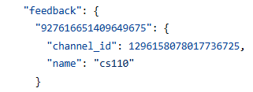
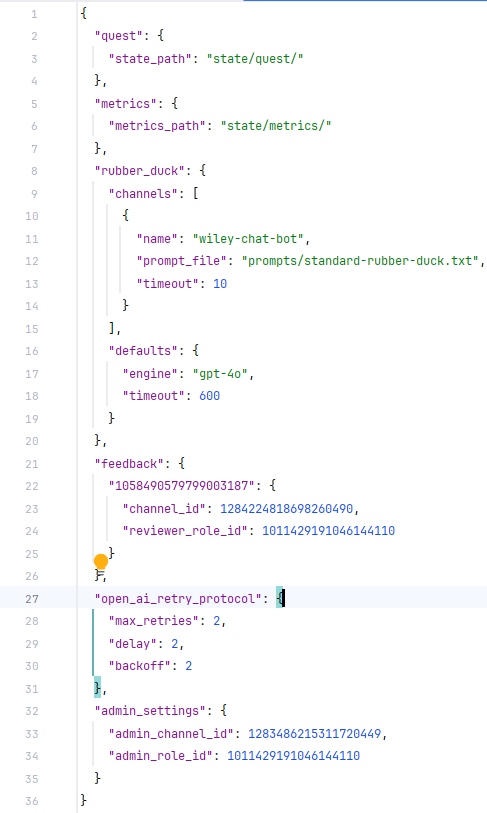
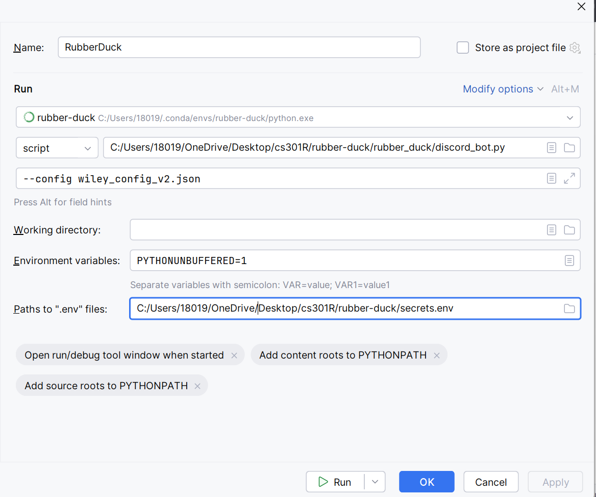

# Rubber Duck Project

## Introduction 
Welcome to the Rubber-Duck Project! This guide will help you set up the project on your local machine and introduce you to the key technologies we use. **This will approximately take three hours.** Contact Dr. Bean if you encounter any major issues.

## Prerequisites
The following technologies each have their own section that you can read specifics about regarding rubber duck. **Please go in order** with this list to save time and to save yourself the headache. If these technologies are unfamiliar to you, don't worry! That's why this guide is here. You can read and learn more about these during your "Research time" each week.
- **Do this very first!** Send the following to Dr.Bean.
  - Your GitHub profile name
  - OPENAI username
  - your Discord Username
- Git
- OPEN AI Account Creation and Organization Set-Up
- Discord Bots
- Customizing your config file
- Docker
- AWS CLI & ECR

## Git
- If you haven't already send your GitHub username to Dr. Bean so he can you add you to the Bean Lab organization in Github.
  - Check your https://github.com/ account to see if you have any pending invites after you have sent your information to Dr. Bean
  - After that look for an organization named "Bean Lab" https://github.com/beanlab.
  - After, go to the repo for rubber duck. This is where you will need to make a clone of your project.
    - It should be something like **git clone https://github.com/beanlab/rubber-duck.git** check the offical documentation.
  - Next you are going to want to check the Rubber Duck Projects tab. Which can be found at the top of your window.
    - Inside here you can find the ongoing projects and issues for the Rubber Duck. We encourage you become familiar with creating issues and branches from this tab. That way you will be better prepared when you meet with Dr. Bean and when he requests a new feature or update.  

## OPEN AI Account
  - **If you haven't done this yet, register an account with OpenAI and send the username and email to Dr. Bean**
  - Check your email to see if you received an email from Dr. Bean inviting you to the BYU Computer Science Bean Organization.
  - Make sure your organization is set correctly. Go to the settings and look for API Keys.
    - Create a new secret key and record this information in a safe place. You will use this information for the rest of the semester. **Do not share this information with anyone! Don't accidently expose it to GitHub. This poses a serious security risk.** We will show you the proper way to protect this information later.

## Discord Bots
  - You are going to learn how to configure a Discord Bot using the intro assignment. This is part is key for learning how to configure your custom config file.
  - The assignment it to create your own discord bot or rubber duck. Follow the instructions posted on this discord channel and finish all the parts. https://discord.gg/YGRXPCCT
  - When you are finished with your bot, upload it on the channel "please-add-my-bot."
  - After you do that you are good to go.

## Customizing your config file
  - Check the repo for the config file and make a copy of it. Rename it to your name.
    - On Bean Lab discord server under Rubber-Duck add a bot channel and an admin channel.
    - Under the channels section go to config section and change the name section to match the name of your discord bot.
    - 
    - **Use this reference above**. Change that long id below the "feedback" to match the server id. This can be found by right-clicking the discord server icon. It should look like a seed.
    - After that, change the "Channel ID" field to match the channel id.
      - You are going to need to add a new channel to rubber duck. Name it to be your-name-chat-bot.
      - After it is created, right click on it to get the channel ID
    - You will need to repeat these steps for the admin channel as well.
      - When the config file asks for a reviewer_role_id or admin_role_id you will need to put your personal discord id in those fields
    - For the name section use any label that makes sense for your channel. This is here for organizational purposes.
    - Your config file should look something like these when you are done.
    - 

## Docker
 - If you haven't taken CS204 or haven't run into Docker, this section is for you. Rubber Duck production line uses Docker to create production ready applications. Knowing how to use it and what is for will bless you as a software engineer.
 - This is going to be a short tutorial on how to get docker working.
 - **Follow the tutorial below to get started. This should take about one hour.**
 - https://byu.instructure.com/courses/25698/pages/docker-topic-preparation?module_item_id=2149065

## AWS CLI & ECR (Optional)
- This section is optional but if you need to access BYU AWS servers please contact Dr. Bean to access.
- You should be able to use this link to go there https://byulogin.awsapps.com/start/#/?tab=accounts

# Intro Assignment
The assignment it to create your own discord bot or rubber duck. Follow the instructions posted on this *instructions* discord channel to test if everything is running correctly. https://discord.gg/YGRXPCCT

## Usage
The bot listens to the configured channel, currently set in the source code as `"duck-pond"`

When a user posts a message to the duck pond, the duck bot 
creates a public thread in response. 

[//]: # (To add a new listening channel, add a file named by the channel in the prompts folder.)
The file should contain the prompt to use for each thread in that channel. 

## Setup
- Create an OPENAI account
  - https://openai.com/
  - Get the API key and provide it as the environment variable `OPENAI_API_KEY` to the bot
- Create a new discord application
  - https://discord.com/developers/applications
  - Get the token under the bot tab and provide it as the environment variable `DISCORD_TOKEN` to the bot
  - Under "Bot"
    - Select "Message content intent"
  - Under "OAuth2"
    - Select "bot" scope
    - Permissions:
      - Send messages
      - Create public threads
      - Send messages in threads
      - Manage threads
      - Add reactions
    - Copy the generated link, paste in the URL bar of your browser, 
      and use it to add the bot to your server
  - Install `poetry`
    - https://python-poetry.org/docs/#installation
    - `curl -sSL https://install.python-poetry.org | python3 -`
  - Clone this repo
    - requires python 3.11
    - run `poetry install`
  - Your configuration should look something like this
  - 

To run on server:
- cd to project folder
- `git pull`
- `poetry install`
- `nohup poetry run python discord_bot.py >> /tmp/duck.log &`

To kill on server:
- `ps -e | python`
- `kill <pid>`

