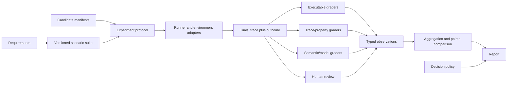

# Agent Evaluation Framework: Design Specification

## Document status

- Status: Draft for discussion
- Scope: Product and technical specification; no implementation is authorized by this document
- Primary question: Can Rubber Duck determine, with useful and reproducible evidence, whether one prompt or agent configuration works better than another?
- Broader question: Can the same framework evaluate complete conversational, tool-using, and workflow-based agents?
- Research basis: [research synthesis](research-synthesis.md) and [source index](README.md)

## Executive summary

The proposed framework is an evidence system for comparing observable agent behavior under controlled conditions. A prompt is treated as one component of a versioned **candidate**. Candidates are run on the same versioned scenarios, usually more than once. Each trial produces an outcome and an observable trace. Deterministic checks, domain-specific measures, model-based graders, and human review produce typed observations with evidence and uncertainty. A comparison layer then reports paired differences, confidence intervals, operational trade-offs, important slices, and failures. A separately declared decision policy says what “better” means for the experiment.

This directly supports prompt A/B experiments, but does not assume that every useful property is pass/fail or that an LLM judge is ground truth. Some requirements are hard invariants, such as “do not invoke an unapproved tool.” Others are uncertain and continuous, such as pedagogical scaffolding or usefulness. The framework must preserve those distinctions instead of collapsing every result into one score.

The proposed design is independent of the existing TesterBot implementation. Existing scenarios, assessor prompts, telemetry, and live Discord runner may become inputs or adapters, but they do not define the framework's data model or evaluation method.

## 1. The problem being solved

Prompt development currently poses a deceptively simple question: “Does prompt B work better than prompt A?” A convincing answer requires more than comparing a few transcripts:

1. “Better” must be defined before observing the result.
2. Both variants must receive comparable situations and environmental conditions.
3. Nondeterministic systems need repeated trials.
4. Observable behavior must be checked at both the final-outcome and interaction-trace levels.
5. Subjective judgments need validation, calibration, and uncertainty reporting.
6. Improvements must be weighed against regressions, latency, token use, cost, and failure rate.
7. Results must be attributable to the prompt rather than an unnoticed model, tool, fixture, workflow, or evaluator change.

The larger problem is the same for complete agents. Rubber Duck includes open-ended tutoring, tool-using statistics support, structured registration, debugging practice, and assignment feedback. These systems do not share one universal notion of quality or one suitable oracle. The framework therefore needs a common experimental core and domain-specific evaluation profiles.

## 2. Intended decisions

The framework should provide evidence for decisions such as:

- Replace prompt A with prompt B, retain A, or declare the result inconclusive.
- Detect a behavioral regression after changing a model, tool, workflow, or dependency.
- Determine whether a candidate meets explicit release gates.
- Locate which scenarios or user groups benefit or regress.
- Characterize reliability, rather than relying on a candidate's best example.
- Investigate failures using the exact trace, configuration, grader evidence, and provenance.
- Monitor whether production behavior is drifting away from validated behavior.

It should not claim to prove that an agent is universally safe, pedagogically effective, or correct. Evaluation supports bounded decisions for declared populations, scenarios, versions, and confidence levels.

## 3. Goals and non-goals

### Goals

- Make fair prompt-to-prompt comparisons a first-class operation.
- Evaluate prompt variants, components, workflows, and complete deployed systems using the same conceptual model.
- Support binary invariants, numeric measures, ordinal ratings, categories, and qualitative findings.
- Combine outcome-level and trace-level evidence.
- Support scripted, branching, simulated, replayed, human-driven, and production-derived scenarios.
- Preserve enough provenance to reproduce or explain a result.
- Report uncertainty, practical effect size, important slices, and invalid trials.
- Separate observations from release or product decisions.
- Permit executable checks, model graders, and human review without treating any one of them as universally authoritative.
- Work in local/component, sandboxed, Discord end-to-end, replay, and production-observation modes.
- Protect student data and avoid retaining hidden model reasoning.

### Non-goals

- A single universal “agent quality” score.
- Automatic discovery of the objectively best prompt.
- Treating LLM-as-a-judge output as ground truth.
- Proving educational learning gains from transcript quality alone.
- Replacing conventional unit, integration, security, or load testing.
- Requiring the existing TesterBot, its pass/fail schemas, or live Discord for all evaluations.
- Optimizing prompts against the evaluation suite without independent holdouts.
- Comparing candidates when multiple undeclared variables changed and calling the result a prompt comparison.

## 4. Terms and normative language

“Must,” “should,” and “may” describe required, recommended, and optional behavior in this proposed specification.

- **Agent evaluation:** Structured collection and interpretation of evidence about whether an AI system satisfies behavioral requirements and achieves its intended purpose in representative situations.
- **Candidate:** A completely identified prompt or system configuration being evaluated.
- **Requirement:** A behavioral expectation, metric, risk, or invariant and the scope in which it applies.
- **Scenario:** A versioned experimental situation including input, initial state, fixtures, user behavior, and slice labels.
- **Trial:** One execution of one candidate on one scenario under one environment configuration.
- **Trace:** Ordered observable events during a trial.
- **Outcome:** The final externally relevant state and artifacts of a trial.
- **Grader:** A procedure or reviewer that converts evidence into typed observations.
- **Observation:** A measured value or finding, plus evidence, provenance, and uncertainty.
- **Evaluation run:** A set of trials executed under one declared protocol.
- **Comparison:** Statistical and qualitative analysis of two or more candidates.
- **Decision policy:** Predeclared rules for interpreting a comparison for a particular decision.
- **Oracle:** A source of expected behavior. It may be exact, partial, statistical, or judgment-based.

Verification and empirical evaluation must remain distinct. Executable checks can verify bounded properties of recorded behavior, such as whether a forbidden tool was called. Repeated experiments can estimate rates or qualities over a sampled distribution. Passing either one does not prove unrestricted correctness.

## 5. Current Rubber Duck system context

This section describes the repository as a case study, not as the required architecture.

The current runtime routes Discord events through `RubberDuckApp` and `DuckOrchestrator` into several workflow styles. The generative AI layer builds agents from prompts, model settings, tools, output formats, and reasoning settings, then executes Responses API calls and tool loops. Quest coordinates multi-turn interactions. SQL-backed metrics record messages, token usage, and TA feedback.

| Agent or workflow type | Important observable behavior | Particularly useful evaluation evidence |
|---|---|---|
| Standard and Socratic tutoring | Dialogue quality, one-question pacing, scaffolding, answer revealing, relevance, termination | Transcript and turn trace, human/domain rubric, policy checks, conversation length, user outcome |
| Statistics assistance | Dataset/tool selection, Python execution, statistical correctness, explanation, artifact delivery | Tool-call arguments and results, executable reference calculations, file/output checks, semantic explanation grading |
| Debugging practice | Diagnosis, pedagogical progression, misconception handling, completion decisions | State transitions, assessment outputs, code/task outcome, detailed pedagogical rubric, repeated-run consistency |
| Registration | Email/role/nickname handling, permission boundaries, retry and completion behavior | Deterministic state and side-effect checks, mocked external effects, invalid-input and authorization cases |
| Assignment feedback | Assignment detection, rubric application, missing-section handling, actionable feedback | Structured output validation, rubric-item references, deterministic document checks, human calibration |
| Conversation review | Quality assessment and reviewer feedback | Human feedback linkage, agreement studies, calibration data |

Existing evaluator-related assets include:

- `src/testing/tester_bot_scaffold/`: a model-driven Discord user simulator and live conversation runner.
- `tests/tester_bot_tests/`: scripted scenarios, transcript assessors, cost collection, and basic end-to-end checks.
- `src/storage/assessment_models.py`: primarily pass/fail assessor outputs with reasoning.
- `src/metrics/` and `src/storage/sql_metrics.py`: production messages, model usage, and TA feedback.
- Detailed rubric-style assessors for debugging practice.
- Archived conversation suites under `archive/education/scratch/suites/`, whose provenance and labels would need auditing before reuse.

These are useful sources of cases and integration knowledge. Their current assumptions—live Discord, an LLM-simulated student, transcript-only grading, predominantly binary judgments, and similar model families for system, simulator, and judge—must not become framework constraints.

## 6. Design principles

### 6.1 Behavior, not prompt text, is evaluated

Prompt wording is not intrinsically “good.” Its value is mediated by a model, decoding behavior, tools, workflow, data, environment, and user. The unit of evidence is resulting behavior. Static prompt linting may find defects, but it cannot establish comparative task or pedagogical performance.

### 6.2 A prompt comparison changes exactly one declared treatment

For a result to be called a prompt comparison, model and version, reasoning and decoding settings, tools and schemas, workflow code, system configuration, fixtures, scenario versions, trial policy, and grader versions must be held fixed. If those differ, the framework must label the experiment a broader system comparison.

### 6.3 Requirements precede graders

A rubric prompt is not the requirement. Requirements should first state the expected behavior, its scope, severity, and measurement type. One or more graders may then operationalize it. This permits a weak grader to be replaced without redefining the product requirement.

### 6.4 Evidence remains typed and inspectable

A boolean invariant, a correctness percentage, a five-point human rating, and a qualitative safety finding convey different information. They must not be silently coerced into pass/fail. Every observation should point back to supporting trace or outcome evidence.

### 6.5 Hard gates and optimization measures are separate

Some failures disqualify a candidate regardless of its average score: privacy violations, unauthorized actions, corrupted state, or severe factual harm. Other properties support trade-offs: helpfulness, brevity, latency, and cost. A weighted average must not allow high stylistic scores to cancel a critical violation.

### 6.6 Comparisons are paired and uncertainty-aware

Candidates should normally be evaluated on the same scenarios and equivalent initial states. Repeated trials estimate run-to-run variability. Reports should emphasize paired deltas, uncertainty intervals, and practical importance rather than isolated averages.

### 6.7 Evaluation code and data are versioned products

Scenarios, graders, reference artifacts, candidate manifests, schemas, and decision policies can all change conclusions. Their exact versions are part of every result.

### 6.8 Evaluation and decision are separate stages

The framework records what happened and how it was measured. A project-specific decision policy interprets the evidence. The same run may support a prompt-development decision, a release gate, or a research analysis with different thresholds.

## 7. Conceptual architecture



The framework core should depend on contracts for candidates, scenarios, trials, traces, outcomes, and observations. Rubber Duck runtimes, Discord, simulated students, model providers, graders, and storage backends should connect through adapters. This keeps the evidence model stable if a current mechanism is replaced.

## 8. Core information model

The following is a conceptual schema, not a commitment to a programming language or storage format.

### 8.1 Evaluation specification

An evaluation specification defines:

- Stable ID, version, title, purpose, owner, and intended decision.
- Target population and explicitly excluded population.
- Candidate IDs and the treatment being varied.
- Scenario suite and suite version.
- Requirements and primary, secondary, diagnostic, and guardrail measures.
- Trial policy, including repetitions, ordering, concurrency, timeouts, and budgets.
- Environment and runner adapter.
- Grader set and versions.
- Statistical analysis and decision policy.
- Privacy classification and artifact-retention policy.
- Known limitations and stopping conditions.

### 8.2 Candidate manifest

A candidate manifest must identify the complete system under test, even if only the prompt differs:

- Candidate ID, label, and immutable content digest.
- Prompt or prompt bundle version and resolved digest.
- Model provider, model ID/version or dated alias, and relevant generation/reasoning settings.
- Tool definitions, schemas, permissions, and versions.
- Workflow/application revision and configuration digest.
- Output schema and safety/policy configuration.
- Knowledge sources, data/fixture versions, and external dependency versions where relevant.
- Environment image or dependency lock identifier.
- Declared treatment relative to the baseline.

Secrets must never be embedded in the manifest. Where a provider cannot guarantee an immutable model version, the manifest should say so and the report should identify that reproducibility limitation.

### 8.3 Requirement

A requirement contains:

- Stable ID and natural-language statement.
- Scope: agent type, scenario tags, user population, and relevant turns or states.
- Kind: invariant, capability, quality measure, risk, or operational measure.
- Measurement scale: boolean, numeric, ordinal, categorical, or qualitative.
- Direction: higher is better, lower is better, target range, or prohibited.
- Severity and whether it is a hard gate.
- Rationale and provenance.
- Known proxy limitations.

Example: “When the learner has not attempted the task, the tutor should elicit an attempt before giving a complete solution.” This is a pedagogical requirement. A trace rule may detect complete answer disclosure, a model grader may judge degree of scaffolding, and a human reviewer may adjudicate uncertain examples.

### 8.4 Scenario

A scenario contains:

- Stable ID, version, source, license/consent classification, and author.
- Target agent/workflow and entry point.
- Initial user input, conversation history, state, files, and external fixtures.
- User driver: fixed script, branching policy, model simulator, recorded replay, or human.
- Allowed and disallowed environment effects.
- Expected outcomes, partial oracles, and applicable requirements.
- Slice labels such as subject, difficulty, misconception, language complexity, accessibility need, tool requirement, adversarial pattern, or privacy risk.
- Maximum turns, time, cost, and termination conditions.
- Reset and cleanup requirements.
- Whether the scenario belongs to development, validation, or sealed holdout data.

Scenarios should describe situations, not encode one preferred response unless an exact response is required. Multiple valid tutoring paths must remain valid.

### 8.5 Trial and trial policy

A trial is one candidate-scenario execution. It records:

- Evaluation, candidate, scenario, runner, environment, and trial-policy identifiers.
- Repetition number, timestamps, seed where supported, and execution order.
- Status: completed, timed out, infrastructure error, setup error, cancelled, or invalidated.
- Observable trace, final outcome, output artifacts, and operational metrics.
- Reasons for invalidation, retries, and deviations from protocol.

Retries must remain visible. A successful retry does not erase an initial provider or workflow failure. Infrastructure failures should be reported separately from agent failures and excluded only by a declared rule.

### 8.6 Trace and outcome

Trace events should have a common envelope: event ID, trial ID, sequence, timestamp, actor/component, event type, parent/causal ID, redaction status, duration where relevant, and typed payload.

Useful event types include:

- User or environment input.
- Assistant-visible output.
- Model request and response metadata.
- Tool call, tool result, and tool error.
- Workflow state transition and guard decision.
- External side-effect request and confirmed result.
- Retry, timeout, exception, or recovery.
- Conversation or workflow termination.

The trace should capture observable actions and provider metadata, not private chain-of-thought. Model request metadata may include token counts, latency, model identity, and finish state. Sensitive prompt and user content may be stored in access-controlled artifacts or represented by digests according to policy.

The outcome is the final user-visible result and relevant external state: answer, generated file, workflow status, registered role, grading artifact, completed debugging item, or explicit failure.

### 8.7 Grader specification

A grader specification defines:

- Grader ID, version, type, applicable requirements, and required evidence.
- Output schema and measurement scale.
- Missing-evidence and abstention behavior.
- Dependencies, prompt/model configuration if model-based, or reviewer protocol if human.
- Calibration evidence and known limitations.
- Cost, timeout, and retry policy.

### 8.8 Observation

An observation contains:

- Requirement and grader IDs.
- Boolean, numeric, ordinal, categorical, or qualitative value.
- Unit, range, and direction where applicable.
- Evidence references to exact trace events or outcome artifacts.
- Explanation appropriate to the grader type.
- Confidence or uncertainty where meaningful.
- Status: measured, missing, invalid, or abstained.
- Grader execution provenance.

“Measured” is not the same as “passed.” Threshold interpretation belongs to the decision policy. This distinction prevents a score of 3/5 from being prematurely converted into truth.

### 8.9 Comparison and decision policy

A comparison records candidate-level summaries, paired scenario deltas, uncertainty intervals, effect sizes, reliability estimates, slice results, guardrail violations, missingness, and operational trade-offs.

A decision policy defines, before final analysis where possible:

- Primary measure and minimum practically important change.
- Required non-inferiority margins for guardrails.
- Hard-gate behavior.
- How missing and invalid trials are handled.
- Whether and how multiple comparisons are controlled.
- Evidence required to declare “better,” “not worse,” “worse,” or “inconclusive.”
- Human adjudication triggers.

## 9. Evaluation modes and adapters

The evidence model should support multiple execution modes:

| Mode | Purpose | Strengths | Limitations |
|---|---|---|---|
| Pure executable/component | Evaluate functions, schemas, state transitions, or tool policies | Fast, deterministic, CI-friendly | Does not represent full dialogue or provider behavior |
| In-process agent | Exercise a prompt/model/tool loop without Discord | Faster isolation and fixture control | May miss integration behavior |
| Sandboxed workflow | Exercise stateful workflows and mocked side effects | Strong reset and outcome checks | Simulation may differ from production services |
| Discord end-to-end | Exercise the real transport and orchestration path | High integration fidelity | Slow, costly, flaky, and harder to reset |
| Transcript/trace replay | Regrade fixed historical or synthetic behavior | Cheap grader development and regression testing | Cannot measure changed agent behavior |
| Human interactive study | Measure real interaction and usability | Highest user validity | Expensive, privacy-sensitive, and difficult to reproduce |
| Production observation | Detect real-world failures and drift | Real distribution and operational evidence | Confounded, incomplete labels, no uncontrolled experimentation by default |

Each runner adapter must provide setup, execute, observe, reset, and teardown semantics. Scenarios involving external effects should default to mocks or isolated test resources. Live Discord evaluation remains a useful adapter, not the framework's central abstraction.

## 10. User-driver strategies

Multi-turn agents require a user or environment policy. Different strategies answer different questions:

- **Fixed script:** Reproducible but cannot naturally react to varying responses.
- **Branching script/state machine:** Reproducible within modeled branches and suitable for known misconceptions or workflow paths.
- **Model-simulated user:** Scalable and adaptive, but introduces simulator bias, collusion, nondeterminism, and another model dependency.
- **Recorded replay:** Represents real inputs while preserving privacy controls; later turns can become incoherent when a candidate responds differently.
- **Human participant or reviewer:** Most direct evidence for user experience and learning, but expensive and difficult to standardize.
- **Adversarial generator:** Expands coverage and can search for failures, but generated cases require validation and deduplication.

Simulated users must have explicit personas, goals, knowledge boundaries, and stopping rules. Their model and prompt are part of scenario provenance. Simulator success should not be conflated with student success.

## 11. Grading strategy

The preferred order is to use the least subjective valid measurement for each property, not the same grader for every property.

### 11.1 Executable and reference-based graders

Use deterministic checks for schemas, exact state, permissions, allowed tools, calculations with known references, artifact existence, termination, retry counts, and other machine-observable properties. They are precise within their scope, but cannot establish open-ended helpfulness or pedagogy.

### 11.2 Trace and temporal-property graders

Inspect action sequences and state transitions, for example:

- A dataset must be loaded before analysis.
- No registration side effect occurs before validation.
- A tutor elicits an attempt before disclosing a complete solution.
- A workflow reaches a terminal state without skipping a required stage.
- Only an allowlisted tool is called and each call receives a result.

Some properties can be expressed as finite-state or temporal rules. This is materially different from transcript judging and is particularly useful for registration, tool use, and debugging workflow progression.

### 11.3 Semantic/model graders

Model graders are useful for open-ended relevance, explanation quality, tone, rubric alignment, and approximate pedagogical behavior. They should:

- Use structured outputs with an explicit rubric and evidence citation.
- Be blind to candidate identity and expected winner.
- Randomize or counterbalance response order for pairwise judgments.
- Permit abstention when evidence is inadequate.
- Be tested for position bias, verbosity bias, self-preference, and sensitivity to irrelevant style.
- Be calibrated against independently labeled human examples from the actual domain.
- Report agreement and systematic disagreement by slice.
- Use multiple judges only when diversity or adjudication is purposeful; majority vote alone does not remove shared bias.

Judge prompts, models, order, and versions are evaluator dependencies. Changing them creates a new evaluation version.

### 11.4 Human review

Human evaluation is appropriate for pedagogical validity, usefulness, accessibility, severe safety findings, ambiguous model-judge cases, and calibration. Reviewer guidance should define the unit of review, scales, examples, conflicts of interest, blinding, and adjudication. Agreement should be measured, but disagreement may reveal an underspecified requirement rather than a bad reviewer.

### 11.5 Hybrid grading

A useful pattern is:

1. Run high-precision executable and trace checks on every trial.
2. Run lower-cost semantic graders on eligible trials.
3. Sample trials for blinded human calibration.
4. Route judge disagreements, critical findings, and boundary cases to adjudication.
5. Keep each observation visible rather than hiding disagreement in a composite score.

## 12. Statistical comparison

### 12.1 Experimental unit and pairing

The scenario, not each individual grader output, is normally the experimental unit. Candidate A and B should run on the same scenario versions and equivalent fixtures. When multiple repetitions exist, analysis must account for trials nested within scenarios rather than pretending every run is independent.

### 12.2 Repeated trials

Repetitions estimate nondeterminism and expose intermittent failures. The required number depends on variance, decision stakes, cost, and minimum effect of interest. A small pilot can estimate variance, but should not be presented as confirmatory evidence.

### 12.3 Reported results

Reports should include:

- Sample and scenario counts, repetition counts, missingness, and invalid trials.
- Candidate results and paired deltas.
- Confidence or credible intervals appropriate to the measure and design.
- Practical effect sizes, not only significance tests.
- Reliability measures such as pass rate, failure rate, and within-scenario variability.
- Guardrail regressions and worst cases.
- Prespecified slices and any exploratory slices clearly labeled.
- Latency, token, cost, timeout, and retry differences.

Scenario-level bootstrap intervals, paired permutation methods, hierarchical models, or exact methods may all be appropriate. The specification should not force one statistical technique across binary, ordinal, continuous, and sparse critical-event data.

### 12.4 Decision labels

At minimum, a comparison should support:

- **Better:** Primary improvement exceeds the practical threshold and all required guardrails pass.
- **Not worse:** Evidence meets declared non-inferiority margins without establishing superiority.
- **Worse:** A primary or guardrail regression crosses its declared threshold.
- **Inconclusive:** The evidence is too uncertain, inconsistent, missing, or confounded.
- **Invalid:** Protocol or provenance failures prevent the requested inference.

Inconclusive is a useful result and must not be silently turned into a tie or a win.

## 13. Fair prompt comparison

### 13.1 Required controls

For a prompt-only comparison, hold constant:

- Model provider and model/version.
- Reasoning and generation settings.
- Tool definitions, permissions, schemas, and implementations.
- Workflow and application revision.
- System configuration and output schema.
- Scenario, fixture, and user-driver versions.
- Trial count, ordering protocol, timeouts, and budgets.
- Grader prompts, models, rubrics, reviewer protocol, and aggregation method.

Provider-side model drift may make exact control impossible. It should be recorded as a limitation and candidates should be interleaved closely enough to reduce time-related confounding.

### 13.2 Preventing overfitting and evaluator gaming

- Separate prompt-development cases from validation and sealed holdouts.
- Avoid placing judge-specific phrasing, expected answers, or rubric exploits into candidate prompts.
- Rotate or refresh cases while retaining stable anchor cases for longitudinal comparison.
- Record all prompt variants tried; repeated selection on one suite makes that suite training data.
- Check performance on slices and qualitatively different cases, not just the aggregate.
- Use adversarial and metamorphic variants to test whether superficial changes alter conclusions.
- Revalidate after model, tool, workflow, or distribution changes.

### 13.3 Example experiment declaration

This illustrative declaration is conceptual, not an implementation format:

```yaml
question: Does the candidate tutoring prompt improve scaffolding without reducing accuracy or increasing direct answer disclosure?
treatment: resolved tutor prompt bundle
baseline: tutor-prompt-a
candidate: tutor-prompt-b
held_constant:
  - model and reasoning settings
  - tool set and workflow revision
  - scenario and simulator versions
  - graders and decision policy
primary_measure: blinded scaffolding rating
guardrails:
  - subject-matter accuracy
  - direct-answer disclosure rate
  - critical safety violations
secondary_measures:
  - learner-rated usefulness
  - successful termination
  - turns, latency, tokens, and cost
analysis:
  design: paired by scenario with repeated trials
  result_labels: [better, not_worse, worse, inconclusive, invalid]
```

The framework would permit this experiment. Whether it yields a trustworthy answer depends on scenario representativeness, grader validity, repetitions, and the declared decision threshold.

## 14. Measurement profiles

The framework supplies common dimensions, while each system selects and operationalizes those that match its purpose.

### 14.1 Common dimensions

- Task success and correctness.
- Reliability across repetitions and scenario variation.
- Robustness to malformed, ambiguous, out-of-distribution, and adversarial inputs.
- Safety, privacy, policy, and authorization boundaries.
- Instruction following and prompt-injection resistance.
- Tool selection, argument correctness, result use, and error recovery.
- Workflow state and side-effect correctness.
- User experience, clarity, relevance, and accessibility.
- Latency, tokens, cost, timeouts, provider errors, and retries.
- Reproducibility and provenance completeness.

### 14.2 Educational-agent profile

Educational agents need additional dimensions:

- Subject-matter accuracy and uncertainty handling.
- Diagnosis of the learner's current understanding or misconception.
- Appropriate scaffolding and progressive hints.
- Avoidance of premature answer or full-solution disclosure when that conflicts with the learning goal.
- Relevance and actionability of feedback.
- Cognitive load, language accessibility, and accommodation needs.
- Respectful, encouraging, non-manipulative interaction.
- Recognition and correction of the agent's own error.
- Support for transfer, explanation, or learner-generated reasoning.
- Student learning, when feasible, measured through pre/post or transfer tasks rather than inferred solely from conversational style.

Transcript proxies such as “asks questions” can be useful but do not establish learning. Real learning studies sit above routine regression evaluation and require stronger study design and consent.

## 15. Reporting and inspectability

Every comparison report should provide:

1. The question, intended decision, and exact treatment.
2. Candidate and environment provenance.
3. Scenario population, suite version, and coverage by slice.
4. Primary result, uncertainty, effect size, and decision-policy outcome.
5. Guardrails and critical findings.
6. Secondary quality and operational trade-offs.
7. Reliability across repetitions.
8. Missing, invalid, timed-out, and retried trials.
9. Judge/human calibration status.
10. Slice regressions and representative failures.
11. Drill-down from aggregate observations to trace events and artifacts.
12. Limitations and whether conclusions are exploratory or confirmatory.

Machine-readable results and a human-readable report should describe the same evidence. Reports should never show a lone aggregate score without denominators, uncertainty, and critical failures.

## 16. Privacy, security, and research ethics

- Student messages, files, identifiers, and feedback require data classification, access control, retention limits, and redaction.
- Production records should not automatically become reusable benchmark data; consent and institutional policy must be established.
- Test fixtures should use synthetic or de-identified data unless real data is explicitly approved.
- Prompt injection and untrusted document content must be preserved as data, not allowed to modify grader or runner instructions.
- Tools and external effects should run with least privilege in isolated test resources.
- Reports should avoid exposing secrets, access tokens, private prompts, or student data.
- Hidden chain-of-thought should neither be requested nor stored as evaluation evidence. Observable actions and concise grader rationales are sufficient.
- Human studies of student learning or accessibility require appropriate ethical and institutional review.

## 17. How the current groundwork relates to this specification

### Potentially reusable evidence and mechanisms

- Existing dry-run scenarios can seed a versioned scenario bank after their assumptions and coverage are reviewed.
- TesterBot can become one model-simulated user adapter.
- Live Discord execution can become one end-to-end runner.
- Debugging assessor criteria can seed explicit pedagogical requirements and semantic graders.
- Current structured-output models demonstrate useful schema enforcement, though their binary scales are too narrow as a universal observation model.
- SQL message, token, and TA-feedback data can inform operational measures, scenario discovery, and eventual production monitoring.
- Existing tool schemas, workflow state, and structured outputs provide natural deterministic and trace-level checks.
- Archived education suites may supply cases only after provenance, privacy, labeling, duplication, and current relevance are audited.

### Important limitations of the current approach

- It centers a simulated student and live Discord, even when deterministic component or sandbox evaluation would be stronger and cheaper.
- Most current assessor outputs reduce nuanced quality to pass/fail plus reasoning.
- Transcript formatting omits much of the tool and workflow trace needed to assess agentic behavior.
- Current tests are closer to illustrative end-to-end checks than controlled comparative experiments with repetition and uncertainty.
- Similar model families may act as target, student, and judge, creating correlated blind spots and self-preference risk.
- Scenario versioning, candidate provenance, grader calibration, statistical comparison, slices, and holdout governance are not yet first-class concepts.
- Production telemetry records useful outcomes and costs but is not yet linked to evaluation requirements, candidate versions, or controlled trials.

### Credible replacement or complementary directions

The future system could rely more heavily on approaches unlike the current transcript-judge battery:

- Executable workflow contracts and finite-state/temporal trace checking.
- Property-based and metamorphic generation of input variants.
- Reference environments for tool tasks with machine-checkable final state.
- Curated benchmark suites with sealed holdouts and repeated paired trials.
- Human-centered review and controlled learner studies.
- Production observability and drift/failure surveillance.
- Adversarial security testing and prompt-injection challenge suites.
- Hybrid neuro-symbolic evaluation in which models interpret open-ended language but symbolic rules verify actions and invariants.

No one direction is sufficient. The framework's role is to let the appropriate evidence types coexist without requiring the existing architecture.

## 18. Proposed first experiments

A two-stage pilot is recommended because it separates framework validation from the hardest judgment problem.

### Pilot A: objective and trace-heavy vertical slice

Use a small statistics or registration suite to compare two deliberately different candidate configurations while holding the rest fixed. Include executable outcome checks, tool/state trace checks, operational measures, repeated trials, and a paired report. This tests whether the experiment machinery detects known differences without depending primarily on a model judge.

The prompt variants can be constructed so that one contains a known, bounded defect or policy omission. This is a framework sensitivity test, not a contest to select a production prompt.

### Pilot B: original prompt-quality use case

Compare two versions of a tutoring prompt on a versioned mixture of representative, difficult, and adversarial scenarios. Measure scaffolding as the primary dimension; use accuracy, direct-answer disclosure, safety, and termination as guardrails; record cost and latency; and calibrate model-based ratings on a blinded human-reviewed sample.

This pilot answers the motivating question more directly. It should initially be labeled exploratory because scenario and rubric validity will still be under development.

The two pilots test different failure modes. Pilot A can show that the framework measures observable behavior correctly. Pilot B can show whether its uncertain semantic evidence is useful for real prompt decisions.

## 19. Framework acceptance criteria

An eventual implementation would satisfy this specification when it can demonstrate all of the following:

- Declare and validate a prompt-only comparison with complete candidate provenance.
- Reject or relabel a purported prompt comparison when undeclared system variables differ.
- Run the same versioned scenarios against at least two candidates with configurable repetitions.
- Capture observable outputs, tool activity, workflow transitions, errors, and operational metrics in a common trace.
- Execute deterministic, trace/property, semantic, and human-import graders through explicit contracts.
- Represent boolean, numeric, ordinal, categorical, and qualitative observations without forced binary conversion.
- Preserve evidence links and abstentions.
- Calculate paired candidate differences with uncertainty and scenario-level slices.
- Apply a separate decision policy and permit an inconclusive result.
- Drill down from a report to candidate, scenario, trial, trace, and grader provenance.
- Distinguish agent failures from runner, provider, fixture, and grader failures.
- Run without Discord for component/sandbox evaluations and with Discord when end-to-end fidelity is required.
- Protect sensitive content according to a declared retention and access policy.
- Reproduce the analysis from immutable run artifacts, subject to documented provider-version limitations.

## 20. Open design questions

These questions should be resolved before implementation details are approved:

1. Which first pilot should define the initial vertical slice: statistics, registration, standard tutoring, or a deliberately small combination?
2. Which exact prompt decision is valuable enough to serve as the first real comparison?
3. What learner population and usage distribution should the initial tutoring scenarios represent?
4. What is the primary measure for that decision, and what change is practically meaningful?
5. Which failures are release-blocking hard gates?
6. How much human review is available for rubric development and judge calibration, and who has the required domain expertise?
7. May production conversations be used for case discovery or evaluation, under what consent and retention policy?
8. Should early execution be local/in-process, sandboxed, Discord end-to-end, or split across these modes?
9. What cost and latency budget is acceptable for development, CI, scheduled, and release evaluations?
10. Who owns scenario approval, sealed holdouts, grader changes, and final deployment decisions?
11. How will unavoidable provider model drift be detected and communicated?
12. At what point would evidence justify a real student learning study rather than continued proxy evaluation?

## 21. Proposed decisions for discussion

The following are recommendations, not approved commitments:

- Adopt the candidate/scenario/trial/trace/observation/comparison model as the common vocabulary.
- Make controlled prompt comparison the first product use case while keeping whole-system comparison explicit.
- Keep decision policies separate from measurement results.
- Require typed multi-dimensional observations and reserve pass/fail for true invariants or explicit thresholds.
- Make local/sandbox execution the default for repeatability and retain Discord as a high-fidelity adapter.
- Start with deterministic and trace evidence, then add model grading where the property genuinely requires semantic judgment.
- Calibrate any model judge used for pedagogical claims against blinded human labels.
- Use a development suite and a protected validation/holdout set from the beginning.
- Run the objective vertical slice before treating a semantic tutoring comparison as decision-grade evidence.
