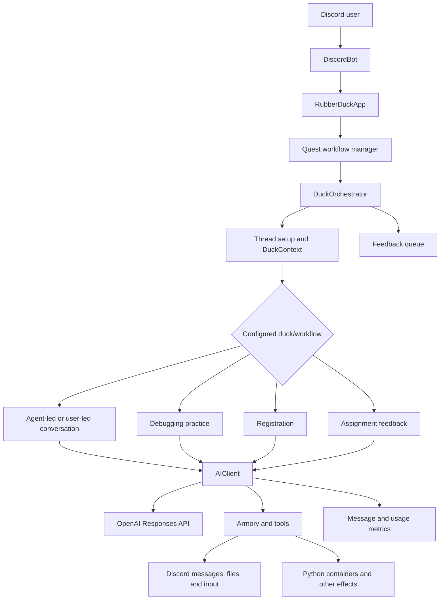
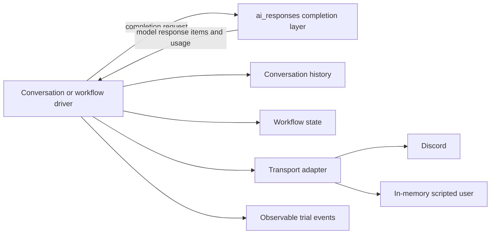
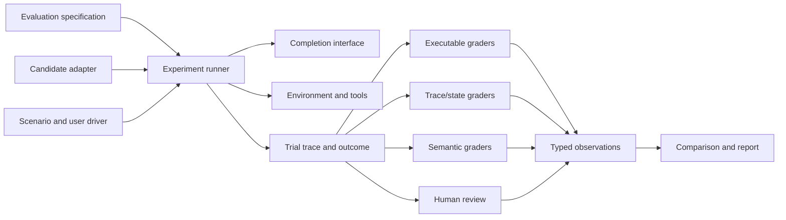

# Rubber Duck evaluation system: current system and experimental design

## Document status

- Status: Draft for discussion
- Purpose: Describe the current Rubber Duck system, identify what can be evaluated at each layer, assess the current testing approach, and define experiments that should precede framework implementation.
- Scope: Design and experiments only. This document does not authorize implementation or production experiments.
- Related documents:
  - [Research synthesis](research-synthesis.md)
  - [Prompt evaluator design](prompt-evaluator-design.md)

## 1. Problem statement

The original request was to evaluate prompts. In Rubber Duck, a prompt does not act by itself. Observable behavior is produced by a configured system containing a model, prompt, tools, model-call loop, conversation history, workflow logic, Discord transport, and user behavior.

The same visible failure can originate in different layers. Examples include:

- A weak tutoring response may come from the prompt, model behavior, missing conversation history, or an unrealistic simulated learner.
- An incorrect statistics answer may come from dataset selection, tool arguments, executed code, result interpretation, or explanation quality.
- An incomplete workflow may come from model tool choice, controller logic, an illegal state transition, timeout handling, or Discord event delivery.
- An early ending may come from a model-requested conclusion, a completion signal, a timeout, or an upstream error.

A transcript can reveal the visible symptom. It usually cannot identify the responsible component unless the trial also records the relevant events, state, and configuration.

The framework must therefore support two related claims:

1. **Prompt comparison:** Prompt A and Prompt B are evaluated while the model, tools, workflow, scenarios, environment, and graders are held constant.
2. **Agent-system evaluation:** A complete candidate configuration is evaluated, including its prompt, model, tools, controller, workflow, environment, and user interaction.

Prompt comparison should be the first supported product use case. The evidence model must still preserve enough system information to explain failures and support broader comparisons.

## 2. Current system

### 2.1 Runtime flow

### 2.2 Current components and responsibilities

| Component | Current responsibility | Evaluation-relevant behavior |
|---|---|---|
| `DiscordBot` / `RubberDuckApp` | Convert and route Discord events | Correct routing, duplicate or lost events, reaction routing |
| Quest workflow manager | Start workflows, deliver events, preserve workflow history | Workflow identity, event ordering, resume behavior, persistence failures |
| `DuckOrchestrator` | Select a duck, create a thread, construct `DuckContext`, handle errors, close the conversation, enqueue feedback | Correct duck selection, thread lifecycle, error classification, close timing |
| `DuckContext` | Carry guild, channel, thread, user, message, and timeout information | Correct addressing, isolation between users/threads, timeout configuration |
| Conversation classes | Connect agent turns to message input/output | History ownership, turn sequencing, user wait behavior, termination |
| `AIClient` | Call the model, manage the local model-visible history, execute tools, validate structured output, record usage/messages, retry some failures | Request construction, tool loop correctness, history correctness, output parsing, retry behavior, termination flags |
| `Agent` configuration | Identify prompt, model, tools, tool choice, output format, and reasoning setting | Complete candidate provenance and controlled treatment |
| `Armory` | Register tools, generate schemas, inject `DuckContext`, execute tool implementations | Tool availability, schema correctness, argument validity, authorization, side effects |
| `TalkTool` | Send/receive Discord messages and conclude conversations | Delivery, missing input, timeout, termination invocation |
| Domain workflows | Implement registration, debugging practice, statistics assistance, and assignment feedback | Domain state, legal transitions, correctness, completion criteria |
| SQL metrics/storage | Record selected messages, usage, feedback, and workflow state | Evidence completeness, linkage, retention, candidate/scenario provenance; current exports omit standard-tutor function-call arguments and serialize some events as Python strings |

### 2.3 The overloaded meaning of context

The current code uses related terms for different data:

- **Discord context:** `DuckContext`, containing guild, channel, thread, author, initial message, and timeout data.
- **Conversation history:** messages and model/tool response items supplied to the model.
- **Workflow state:** durable progress such as registration fields or debugging-practice priorities.
- **Evaluation context:** candidate, scenario, trial, environment, and grader provenance.

The design should use explicit names for these concepts. Candidate names are `DiscordContext`, `ConversationHistory`, `WorkflowState`, and `TrialContext`. Exact names can follow the application refactor, but these values should not share one unqualified `context` abstraction.

### 2.4 Planned completion-layer refactor

The coworker's described `ai_responses` refactor separates standalone agent completions from Discord concerns. This is a useful boundary for evaluation because judges and local trials should be able to invoke a model without manufacturing a dummy Discord thread.

The intended responsibility split is:

The completion layer should accept model-visible inputs and return model-visible outputs and provider metadata. The driver should own conversation history, decisions about when to call the model again, message delivery, and termination. Tools may still require environment-specific services, but Discord identity should not be required by a tool that has no Discord behavior.

The refactor is available on `origin/bean-ai-refactor`, but it currently expresses an intended boundary rather than a runnable equivalent of current behavior. Its `Agent.prompt` is not sent to the provider, required client/retry initialization is absent, Armory method names and context-wrapped tools do not align, and the current tool loop is not completed. It must pass a completion-adapter conformance and parity experiment before an evaluation can claim that it is testing deployed prompt behavior.

## 3. What must be evaluated

Evaluation begins with requirements. A component is not assigned a score merely because it exists. Each decision selects the relevant requirements, scenarios, measurements, and thresholds from the layers below.

### 3.1 Component evaluation matrix

| Layer | Questions | Evidence and measures | Suitable grader |
|---|---|---|---|
| Prompt and agent configuration | Does the candidate produce the desired behavior under fixed conditions? Does it follow tool and termination instructions? | Task success, instruction violations, premature termination rate, answer disclosure, robustness across paraphrases, tokens and latency | Paired scenarios; executable checks; calibrated semantic/human ratings |
| Completion layer | Is the provider request constructed correctly? Are all response item types, structured outputs, usage, errors, and retries handled correctly? | Contract pass rate, schema-validation rate, response-item preservation, retry/error classification, usage consistency | Unit and contract tests with fake/provider fixtures |
| Tool loop | Are tools selected and invoked correctly? Does every call receive a result? Are malformed arguments and failures handled? | Tool choice accuracy, argument validity, call/result pairing, redundant calls, recovery rate, forbidden calls | Trace assertions and executable tool fixtures |
| Conversation driver and history | Are the correct events retained and supplied in order? Does the driver wait, continue, and terminate correctly? | History completeness/order, duplicated turns, missing tool results, turn count, premature/late termination, timeout classification | State-machine or temporal trace checks |
| Domain workflow | Does the workflow reach a valid outcome through legal transitions? | Terminal state correctness, partial progress, skipped stages, invalid transitions, idempotency, recovery | State/outcome assertions and domain-specific checks |
| Transport and Discord integration | Do messages reach the correct channel/thread and do incoming events reach the correct workflow? | Routing correctness, delivery failures, duplicates, ordering, time to first response, thread lifecycle | Mock transport tests plus selective Discord end-to-end tests |
| Complete agent system | Does the user goal succeed under representative conditions without critical violations? | Scenario success, reliability across repetitions, guardrails, cost, latency, failure categories, important slices | Multiple typed graders and a declared decision policy |
| Semantic evaluator | Does the judge measure the intended quality reliably? | Human agreement, precision/recall by class, abstention, repeated-run consistency, order/verbosity/injection sensitivity | Independently labeled calibration set and metamorphic tests |
| Production behavior | Does deployed behavior match the validated population, and are new failures appearing? | Operational failures, drift, feedback, incidents, sampled quality, distribution changes | Monitoring and reviewed samples; not controlled causal comparison |

### 3.2 Measurement types

The framework needs typed observations because the following measurements are not interchangeable:

- **Boolean invariant:** A forbidden tool was called; a required result is missing.
- **Categorical outcome:** Completed, timed out, provider error, workflow error, user abandonment.
- **Numeric measure:** Cost, latency, token count, calls, turns, percentage correct.
- **Ordinal rating:** Scaffolding quality on an anchored scale.
- **Qualitative finding:** A reviewer identifies an unexpected harmful or confusing behavior.

Critical invariants should act as hard gates. Trade-off measures such as helpfulness, latency, and cost should remain visible separately. A high average quality score must not cancel an unauthorized action or severe correctness failure.

### 3.3 Workflow-specific profiles

#### Standard and Socratic tutoring

- Subject-matter correctness and honest uncertainty.
- Diagnosis of the learner's current understanding.
- Appropriate scaffolding and hint progression.
- Premature solution or answer disclosure.
- One-question pacing and clarity.
- Appropriate continuation and termination.
- Learner effort, successful self-correction, and later learning outcomes where feasible.

#### Statistics assistance

- Dataset selection and metadata use.
- Statistical method appropriateness and assumption checking.
- Executed code and numerical correctness through independent recomputation.
- Tool argument and result handling.
- Artifact delivery and reproducibility.
- Explanation accuracy and clarity.

#### Debugging practice

- Correct tracking of concept, location, intent, and fix priorities.
- Recognition of complete, incomplete, incorrect, and unrelated student responses.
- Legal progression through priorities and exercises.
- Feedback targeted to the active misconception.
- Completion only after declared conditions are satisfied.

#### Registration

- Identity and email validation before protected effects.
- Legal ordering of nickname and role changes.
- Correct final state and side effects.
- Permission failure, retry, timeout, and escalation behavior.
- Idempotency and safe resumption.

#### Assignment feedback

- Project detection and input validation.
- Rubric coverage and evidence linkage.
- Correct structured output and missing-section handling.
- Actionability and domain-expert agreement.

## 4. Cross-layer diagnosis examples

### 4.1 Semantic tutoring quality

Example requirement:

> When a learner presents an incorrect attempt, the tutor should identify the relevant misconception and provide a next step that advances the learner without immediately supplying the complete solution.

Evidence may include the learner's attempt, model-visible history, prompt and model configuration, tutor response, later learner response, and human or calibrated semantic ratings. A trace can establish which history the model saw. Human or semantic evidence is still required to judge whether the response was pedagogically appropriate.

### 4.2 Statistics correctness

Example requirement:

> When asked for a numerical analysis, the agent should use the correct dataset and method, produce a reproducible result, and explain it accurately.

The outcome can be independently recomputed. The trace can check dataset selection, tool arguments, code, and tool results. A semantic grader or reviewer can assess whether the explanation accurately represents the calculation and its assumptions.

### 4.3 Conversation completion

Example requirement:

> The standard tutor may conclude only after the learner explicitly ends the conversation or the declared completion condition has been observed.

Useful trace events include:

1. User message received.
2. Conversation history updated.
3. Completion requested with candidate and prompt digest.
4. Model returned `conclude_conversation` tool call.
5. Tool arguments validated.
6. Tool raised or returned a conversation-complete signal.
7. Driver transitioned to completed.
8. Orchestrator sent the closed message.

This supports several distinct observations:

- **Prompt/agent observation:** The model requested termination without transcript evidence satisfying the rule.
- **Tool-loop observation:** The completion signal was interpreted according to the tool contract.
- **Driver observation:** The driver stopped after the completion transition.
- **Discord observation:** The closed message was sent once to the correct thread.
- **System outcome:** The learner's task remained incomplete when the conversation ended.

The first observation may indicate a prompt or model-behavior problem. The remaining observations can show whether the application correctly executed the model's request. Completion is therefore one useful cross-layer diagnostic case rather than the organizing goal of the framework.

## 5. Current testing system

### 5.1 Existing layers

The repository currently contains:

1. **Unit and regression tests** for SQL metrics, dataset tools, Python output formatting, rubric generation, response/tool completion behavior, structured output validation, and retry paths.
2. **TesterBot end-to-end tests** that start the Rubber Duck application, connect through Discord, use a model-driven tester as the user, collect a conversation history and cost, and run post-conversation model assessors.
3. **Four current dry runs** covering the standard duck, general statistics duck, CS statistics duck, and debugging-practice workflow.
4. **A debugging assessor battery** that applies several criteria independently rather than relying only on one broad prompt.

### 5.2 What the current tests establish

- Important local contracts work for the specifically tested cases.
- The deployed-style application can start and interact through Discord.
- A model-driven test conversation can reach the application's close message without the orchestrator error marker.
- Existing transcript assessors can return structured pass/fail results.
- Token usage and estimated cost can be collected for the TesterBot and Rubber Duck sides.

### 5.3 What the current tests do not establish

- Whether one prompt is better than another under a controlled treatment.
- Reliability across repeated stochastic trials.
- Whether the scenario suite represents actual or intended use.
- Whether the simulated student behaves like a real learner.
- Whether the model assessor agrees with expert humans or is sensitive to order, verbosity, self-preference, or prompt injection.
- Which component caused a failure visible in the transcript.
- Tool and workflow trace correctness when the transcript omits internal events.
- Confidence intervals, practical effect size, or an inconclusive comparison.
- Candidate, scenario, grader, and environment version provenance sufficient for reproduction.
- Complete reconstruction of current standard-tutor conversations from the downloaded metrics export; the tutor's visible `talk_to_user` arguments are absent.

### 5.4 Recommended role for TesterBot

TesterBot should be retained as a high-fidelity Discord runner and one possible simulated-user driver. It should implement the same trial and trace contracts as local or sandbox runners.

It should not define the framework's data model or be required for component evaluations. Live Discord adds useful coverage for routing, message queues, permissions, thread lifecycle, and deployed composition, while also adding latency, credentials, side effects, flakiness, and simulator dependence.

## 6. Proposed evaluation architecture

### 6.1 Stable experiment concepts

The common model should use:

- **Candidate:** The fully identified system configuration under test. A prompt variant is one possible treatment within a candidate.
- **Requirement:** The behavior or property to measure and its scope.
- **Scenario:** Initial input, state, fixtures, user driver, limits, and slice labels.
- **Trial:** One candidate execution on one scenario.
- **Trace:** Ordered observable events from the trial.
- **Outcome:** Final external state and artifacts.
- **Grader:** A procedure or reviewer that creates an observation from evidence.
- **Observation:** A typed result with evidence and provenance.
- **Comparison:** Paired analysis across candidates and scenarios.
- **Decision policy:** Predeclared rules that interpret evidence for a particular decision.

### 6.2 Replaceable interfaces

Local drivers, TesterBot, Discord, the planned completion module, model judges, and deterministic graders can change independently if they implement explicit contracts.

### 6.3 State machines

State machines have three useful roles:

1. **Experiment lifecycle:** Declared → validated → prepared → running → completed/failed → graded → analyzed → reported.
2. **Trial and driver lifecycle:** Waiting for input → requesting completion → executing tools → delivering output → waiting/complete/error.
3. **Domain and policy monitors:** Registration transitions, debugging-practice progression, tool-call/result pairing, and termination rules.

Open-ended tutoring quality should not be reduced to a large rigid state graph. The state machine can monitor observable milestones and prohibited transitions while semantic or human graders assess whether a hint or explanation was pedagogically appropriate.

## 7. Experiments before framework implementation

### Experiment 1: prompt-evaluator feasibility

**Question:** Can two prompts be compared on fixed scenarios while holding the rest of the candidate configuration constant and preserving the evidence needed to explain the result?

**Method:**

- Select one narrow behavior with clear positive, negative, and borderline examples.
- Define a baseline prompt and a purposeful variant with one declared change.
- Run both through the planned Discord-free completion interface on the same versioned inputs.
- Verify that the exact resolved prompt and model-visible history are present in the outbound request; the current refactor branch does not yet satisfy this check.
- Preserve resolved prompt/model/tool configuration, raw outputs, usage, errors, timing, and grader evidence.
- Apply deterministic guardrails plus provisional human and semantic ratings without collapsing them into one score.

**Success evidence:** The completion adapter passes its request/response conformance checks; the system can identify exactly what changed, reproduce analysis from saved outputs, expose disagreement among graders, and return an inconclusive result when the evidence is weak.

**Design decision informed:** Minimal prompt-evaluation data model, completion interface, scenario format, observation types, and result report.

### Experiment 2: semantic-grader validation

**Question:** Can a model grader reliably measure the narrow behavior selected for Experiment 1?

**Method:**

- Create an independently human-labeled set containing clear positive, clear negative, borderline, paraphrased, verbose, order-swapped, and injection-bearing examples.
- Blind the judge to prompt identity and expected results.
- Repeat judge calls and measure agreement, class-level errors, abstention, and systematic bias.

**Success evidence:** Supported uses and failure slices are explicit. The result may show that the judge is suitable only for triage or requires human adjudication.

**Design decision informed:** Whether semantic grading can influence prompt decisions and under what review policy.

### Experiment 3: multi-turn prompt evaluation

**Question:** Can the prompt evaluator measure behavior that emerges over a conversation rather than from one isolated response?

**Method:**

- Use an in-memory scripted or branching learner driver that owns conversation history.
- Compare prompt candidates on the same learner states, misconceptions, and direct-answer requests.
- Record history updates, completion requests/results, tool activity, delivered messages, state transitions, and outcomes.
- Combine semantic ratings with deterministic checks for observable policies and workflow events.

**Success evidence:** The report distinguishes response quality, conversation-level behavior, deterministic violations, and driver/infrastructure failures.

**Design decision informed:** Conversation-driver, user-policy, trace, repetition, and multi-turn grading contracts.

### Experiment 4: objective framework-sensitivity pilot

**Question:** Can the evaluation method reliably detect a known behavior difference without relying primarily on a model judge?

**Candidate workflow:** Statistics or registration.

**Method:**

- Create a baseline and a candidate with one known bounded defect.
- Run both on the same success, malformed-input, edge, and recovery scenarios.
- Repeat stochastic trials and interleave candidate order.
- Apply executable outcome checks, trace checks, and operational measurements.

**Success evidence:** The declared grader detects the defect on the intended scenarios, does not invent differences on unaffected scenarios, and attributes infrastructure failures separately.

**Design decision informed:** Minimal experiment core, repetition policy, artifact layout, and comparison report.

### Experiment 5: Discord fidelity

**Question:** Which failures appear only when the same scenario runs through Discord?

**Method:**

- Select a few scenarios already validated in memory or a sandbox.
- Run them through the TesterBot/Discord path.
- Compare business outcomes and event categories, while expecting Discord-specific events to differ.
- Measure additional latency, failures, setup cost, and missing observability.

**Success evidence:** The team can name the risks covered uniquely by Discord and decide how frequently this suite should run.

**Design decision informed:** Boundary between routine local evaluation and selective end-to-end evaluation.

### Experiment 6: first real prompt comparison

**Question:** Does a purposeful prompt change improve one declared tutoring behavior without violating correctness, disclosure, termination, safety, cost, or latency guardrails?

This experiment should begin only after the runner, trace, comparison, and semantic-grader assumptions used by it have passed the relevant earlier experiments.

## 8. Recommended sequence

1. Review and correct the current-system map with the application and refactor owners.
2. Select one narrow, important prompt behavior and create a small human-reviewed example set.
3. Run the prompt-evaluator feasibility experiment through the Discord-free completion boundary.
4. Validate the semantic grader used for that behavior.
5. Extend the experiment to controlled multi-turn scenarios and observable traces.
6. Run the objective sensitivity pilot using synthetic fixtures.
7. Decide the routine role of local, sandbox, and Discord execution from measured evidence.
8. Freeze a scenario set and run the first controlled prompt comparison.

This order produces architectural evidence before a large framework is built. Each experiment should end in a recorded decision, including an inconclusive or rejected approach.

## 9. Open questions

- Which prompt behavior is important, narrow, and clear enough for the first human-reviewed calibration set?
- Does the completion refactor expose raw response items, usage, errors, tool requests, and model/provider identifiers needed for trial traces?
- Which layer will own tool execution after the refactor: the completion layer or a conversation/workflow driver?
- Should the first objective pilot use statistics calculations or registration state transitions?
- Who can label a small tutoring calibration set, and what property can they judge consistently?
- Which production conversations may be used for scenario discovery, under what redaction and retention rules?
- What practical improvement would justify adopting a new prompt, and which regressions are unacceptable?

## 10. Current recommendation

Use the planned completion refactor as a replaceable low-level adapter after it passes conformance and application-parity checks. Start with a focused prompt evaluator built around candidates, scenarios, trials, typed observations, and paired comparisons. Add conversation traces as prompt evaluation expands into multi-turn and tool-using behavior. Keep TesterBot as a selective Discord end-to-end adapter.

The first design proof should compare two prompts on a narrow behavior and preserve enough evidence to inspect the result. The first measurement proof should test its semantic grader against human labels. The broader agent-evaluation framework can then reuse the resulting experiment, trace, and observation contracts for objective workflows and complete-system evaluation.
