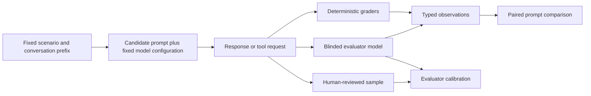
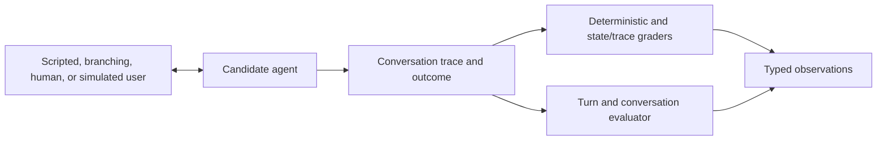
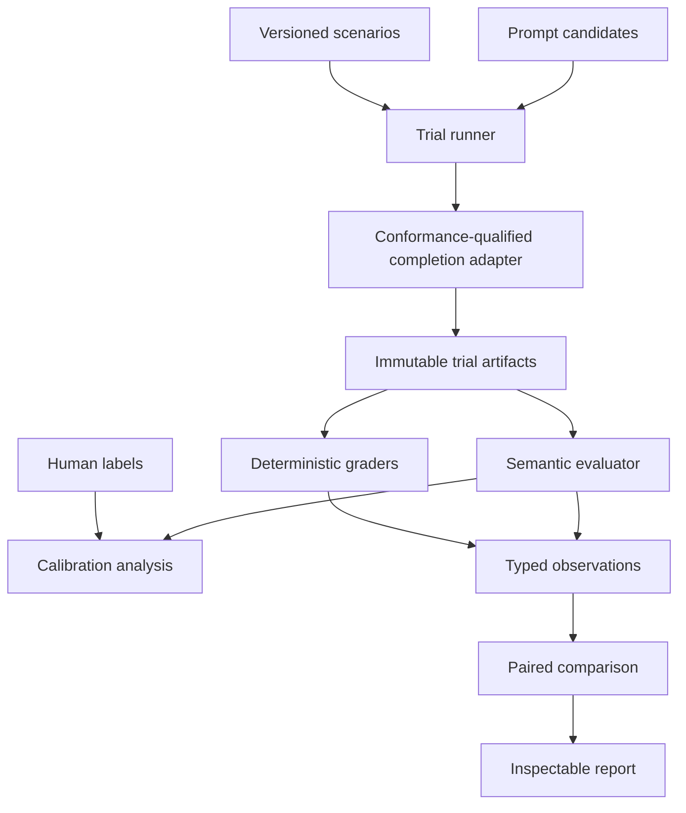

# Rubber Duck prompt evaluator: experimental design

## Document status

- Status: Draft for discussion
- Purpose: Define the first prompt-evaluation experiments and the smallest system needed to run them.
- Initial scope: Response-level evaluation using fixed conversation checkpoints, followed by controlled multi-turn evaluation.
- Broader context: This is the first AI-centered component of the proposed agent-evaluation system described in [current-system-evaluation-design.md](current-system-evaluation-design.md).
- Research basis: [research-synthesis.md](research-synthesis.md) and [README.md](README.md).
- Product specification: [prompt-evaluator-specification.md](prompt-evaluator-specification.md).

## 1. Goal

The prompt evaluator should produce inspectable evidence about whether a prompt change improves declared behavior when the rest of the candidate configuration is held constant.

The first decision it should eventually support is:

> Given the same model, tools, settings, and scenario set, does Prompt B improve one or more declared tutoring behaviors over Prompt A without causing unacceptable regressions?

The evaluator measures behavior produced by a prompt and model together. It does not determine prompt quality from prompt text alone.

### 1.1 Working definition

**Prompt evaluation is a controlled empirical comparison of the observable behavior produced by one or more prompt variants on the same versioned scenarios, under an otherwise fixed agent configuration, using declared behavioral criteria and inspectable evidence.**

The result is a bounded claim about those prompts with the selected model, settings, tools, scenarios, and evaluation protocol. It is not a universal statement that one prompt is intrinsically better in every system or situation.

The thing being varied may be one prompt or a resolved prompt bundle. That variation is the experimental treatment. Model version, reasoning settings, tool definitions, application behavior, scenarios, graders, and trial policy must remain fixed for the result to be described as a prompt-only comparison. If other components vary, the experiment becomes a broader candidate or system comparison.

Prompt evaluation produces a body of evidence rather than a single universal score. That evidence may include criterion ratings, deterministic violations, paired differences, variation across repeated trials, operational costs, evaluator disagreements, and representative failures.

### 1.2 Stable conceptual stages

The implementation may change, but the evaluation idea requires the following stages:

1. State the decision and behavioral requirements before inspecting comparative results.
2. Identify the prompt treatment and freeze the remaining candidate configuration.
3. Run prompt candidates on the same versioned scenarios.
4. Preserve the observable response, trace, outcome, operational data, and provenance.
5. Apply deterministic, semantic, and human graders where each is appropriate.
6. Validate uncertain semantic graders against independent human labels.
7. Compare candidates with uncertainty, failure slices, and declared guardrails.
8. Report better, worse, not worse, inconclusive, or invalid within the experiment's stated scope.

### 1.3 Relationship to adjacent activities

- **Static prompt inspection** can find formatting mistakes, missing instructions, or conflicting text. It cannot establish how the configured model will behave.
- **Response-level prompt evaluation** compares candidate behavior from an identical learner message or conversation prefix.
- **Conversation-level prompt evaluation** compares behavior that emerges across turns, user responses, tools, and conversation state.
- **Agent-system evaluation** permits other components such as models, workflows, tools, or transports to vary and therefore supports a broader claim.
- **Production monitoring** observes deployed behavior and distribution changes but does not by itself provide the controls of a prompt experiment.

### 1.4 Conceptual success conditions

A prompt-evaluation result is useful when a reviewer can determine:

- What changed and what was held constant.
- Which situations were evaluated and which population they represent.
- Which behavior each criterion intends to measure.
- What observable evidence supports every result.
- How consistent the behavior and evaluator were across repetitions.
- Which failures, disagreements, exclusions, and limitations affect the conclusion.
- What decision follows from the evidence and what would remain inconclusive.

## 2. Why begin here

Many application properties have direct or partially formal oracles. Tool-call/result pairing, structured-output validation, legal workflow transitions, numerical calculations, and Discord routing can be checked with conventional tests, executable assertions, or state/trace rules.

Tutoring quality is less direct. Correctness, misconception diagnosis, scaffolding, relevance, answer disclosure, and actionability require interpretation. A model-based evaluator can make that interpretation scalable, but the evaluator itself must be tested against human judgment and against known biases.

This makes the prompt evaluator a useful first research target. It requires the project to solve its hardest measurement questions while producing contracts that later agent-evaluation components can reuse.

## 3. Evaluation stages

### 3.1 Stage 1: response-level evaluation

Each scenario provides a fixed learner message or conversation prefix. Every prompt candidate receives the same model-visible input.

Stage 1 estimates response quality **conditional on that supplied input**. If a conversation prefix contains assistant turns produced by a historical prompt, the result does not establish how another prompt would have produced the conversation up to that point. Scenario provenance must identify who produced each prior turn. Whole-conversation prompt claims require neutral or independently authored prefixes, sensitivity checks, or Stage 2 rollouts.



No user-simulator agent is needed in this stage. Fixing the input removes simulator behavior as a source of variation and makes prompt candidates directly comparable.

### 3.2 Stage 2: conversation-level evaluation

The prompt evaluator later adds a user driver that interacts with the candidate across multiple turns.



The initial user driver should be scripted or branching so trials remain reproducible. A model-simulated learner can be added for exploration after its behavior is compared with reviewed learner examples.

### 3.3 Evaluator role

The initial evaluator should be a constrained model call with a structured output contract. It does not need autonomous planning or tools for the first experiment.

The evaluator receives only the evidence needed by its rubric:

- The learner message or conversation prefix.
- The candidate response, with candidate identity removed.
- The task or subject reference information needed to judge correctness.
- One criterion-specific rubric with behavioral anchors.
- An instruction to cite observable evidence and abstain when evidence is insufficient.

The evaluator should not see the expected winner, feedback score, prompt label, or prompt text unless a particular criterion requires it.

## 4. Seed data from feedback conversations

### 4.1 Available starting material

The downloaded feedback export contains 43 five-star records for `standard-rubber-duck`, and all 43 thread identifiers link to message rows. A completeness audit found that these linked rows do **not** reconstruct the full conversations: 713 of 715 rows are `function_call_output`, two are `assistant`, and none are the `function_call` records that contained the tutor's visible `talk_to_user` messages. The current export therefore supplies feedback-linked thread identifiers and many learner replies, but not usable complete transcripts.

A five-star score is a conversation-level signal, not a turn-level ground-truth label. It may reflect overall usefulness, reviewer preference, successful completion, or factors absent from the export. It does not establish that every response was correct or pedagogically ideal.

Historical conversations can seed the experiment only after a source-completeness gate confirms ordered learner and tutor turns, roles, visible delivery, and relevant tool events. This may require a Discord transcript export or newly instrumented traces. Incomplete sources must be marked unusable rather than reconstructed through assumptions.

### 4.2 Proposed curation process

1. Obtain an approved source capable of reconstructing complete conversations.
2. Audit each source for ordered learner and tutor turns, roles, and evidence completeness.
3. Select a small, varied sample of complete, five-star standard-duck conversations.
4. Remove Discord identifiers and redact personal or course-sensitive content.
5. Divide each conversation at meaningful learner turns to create response-level checkpoints.
6. Preserve the original duck response as a historical reference, not as the required answer.
7. Have reviewers independently label the relevant behavior at each checkpoint.
8. Add naturally occurring and controlled negative and borderline examples.
9. Record why each example is included, its source family and history producer, and which criteria it can validly test.

The reviewed example pool should include positives, negatives, and borderline cases. A positive-only set cannot estimate false positives or show whether a judge distinguishes excellent, acceptable, and poor behavior.

### 4.3 Data partitions

- **Rubric-development set:** Visible examples used to refine criteria and behavioral anchors.
- **Evaluator-development set:** Human-labeled examples used to select and refine a judge protocol.
- **Evaluator-qualification set:** Sealed human-labeled examples used after the judge protocol is frozen to establish supported use.
- **Prompt-development scenarios:** Cases used while creating prompt variants.
- **Validation scenarios:** Cases withheld until the prompt and evaluation protocol are frozen.

All checkpoints, paraphrases, controlled edits, and adjacent turns derived from one source conversation or learner must remain in the same partition. Analysis must retain the source family as the independent cluster rather than counting every checkpoint as independent evidence.

## 5. Initial evaluation dimensions

The preliminary experiment will begin with three criteria: subject accuracy, guidance/scaffolding, and answer disclosure. These provide a deliberately small test of whether the system can capture correctness, pedagogical usefulness, and preservation of learner work.

| Dimension | Question | Initial scale | Evidence |
|---|---|---|---|
| Subject accuracy | Is the response factually and technically correct for the learner's question? | Incorrect / partially correct / correct / abstain | Response plus subject reference |
| Diagnosis | Does the response recognize the learner's demonstrated understanding or misconception? | Misses / partially recognizes / accurately recognizes / not applicable | Learner attempt and response |
| Guidance and scaffolding | Does the response provide an appropriate next step at the learner's current level? | Harmful or absent / weak / useful / especially effective / abstain | Conversation prefix and response |
| Answer disclosure | Does the response reveal more of the solution than the scenario permits? | Prohibited disclosure / excessive help / appropriate help / not applicable | Scenario policy and response |
| Relevance | Does the response address the learner's current need without distracting material? | Irrelevant / partly relevant / relevant / abstain | Learner message and response |
| Actionability | Can the learner take a clear next step from the response? | No next step / vague / actionable / not applicable | Response |

Diagnosis, relevance, and actionability remain in the table because they may explain disagreements in the three initial criteria, but they are not primary measurements for the preliminary experiment. Tone, accessibility, coherence, completion, safety, and other dimensions remain important. They should enter an experiment when the selected decision requires them or when they are guardrails.

For this preliminary experiment:

- **Subject accuracy** is a required correctness guardrail.
- **Guidance/scaffolding** is the primary semantic quality being explored.
- **Answer disclosure** is a pedagogical guardrail.

The experiment should report these separately. It should not define an overall tutoring-quality score by averaging them.

### 5.1 Deterministic observations

Where relevant, the same trial can also record:

- Structured-output validity.
- Required or forbidden tool calls.
- Tool argument schema validity.
- Exact or independently recomputed task results.
- Presence of prohibited content with an executable oracle.
- Tokens, latency, retries, and provider errors.

These observations should remain separate from semantic ratings.

## 6. Candidate, scenario, trial, and observation

### 6.1 Candidate

A candidate identifies the complete configuration needed to reproduce behavior:

- Candidate ID and human-readable label.
- Resolved prompt content and digest.
- Model/provider identifier.
- Reasoning and generation settings.
- Tool definitions and schemas.
- Output schema.
- Application/completion-adapter revision.

For a prompt-only experiment, the prompt is the declared treatment and the remaining fields must match.

### 6.2 Scenario

A Stage 1 scenario contains:

- Stable ID and version.
- Learner message or model-visible conversation prefix.
- Task and subject reference material, when needed.
- Applicable criteria and deterministic checks.
- Behavioral constraints, such as how much help is permitted.
- Slice labels such as subject, difficulty, learner state, misconception, or direct-answer request.
- Source and review/redaction provenance.
- Development, calibration, or validation partition.

### 6.3 Trial

A trial is one execution of one candidate on one scenario. It records:

- Candidate, scenario, evaluator version, and repetition number.
- Resolved request configuration.
- Raw observable response items.
- Parsed response or tool request.
- Usage, latency, retries, timestamps, and errors.
- Trial status and reasons for invalidation.

### 6.4 Observation

Each grader produces a typed observation containing:

- Requirement or criterion ID.
- Boolean, categorical, numeric, ordinal, or qualitative value.
- Evidence references into the response or trace.
- Grader identity and version.
- Abstention or missing-evidence status.
- Concise rationale when appropriate.

Observations should not be silently converted into one aggregate score.

## 7. Grading protocol

### 7.1 Criterion-specific grading

Use separate criteria with concrete behavioral anchors. One broad “is this a good tutoring response?” prompt makes disagreements difficult to diagnose and validate.

The structured evaluator output should resemble:

```yaml
criterion_id: guidance
rating: useful
evidence:
  - response segment or evidence reference
rationale: concise explanation tied to the rubric
abstain: false
```

The exact schema belongs in the later specification.

### 7.2 Pointwise and pairwise evidence

- **Pointwise grading** checks each response against stable criteria. It supports longitudinal reporting and criterion-level failure analysis.
- **Pairwise grading** asks which of two responses better satisfies a criterion. It may make fine distinctions easier but introduces order effects and does not show whether either response meets an absolute standard.

The first experiment should test both. Pairwise order should be swapped, candidate labels hidden, and inconsistent swapped judgments retained as disagreement rather than forced into a winner.

### 7.3 Human calibration

Human reviewers should receive the same anchored criteria but should label examples independently of the evaluator model. The calibration analysis should report:

- Agreement overall and by criterion and scenario slice.
- Class-level confusion, especially severe false passes.
- Repeated evaluator consistency.
- Pairwise order-swap consistency.
- Effects of response length and superficial style.
- Abstention and human disagreement.

Human disagreement may identify an unclear rubric or underspecified scenario. It should not automatically be resolved by majority vote.

## 8. Comparison and reporting

Prompt candidates should run on paired scenarios. Stochastic trials should be repeated enough to estimate within-scenario variation, with candidate runs interleaved when provider drift is possible.

The initial report should show:

- Scenario and trial counts, repetitions, exclusions, and errors.
- Criterion-level results for each candidate.
- Paired differences and uncertainty.
- Deterministic guardrail failures.
- Reliability across repetitions.
- Results by predeclared slice.
- Tokens, latency, retries, and cost.
- Human/evaluator agreement for criteria that use model grading.
- Representative disagreements and failures linked to raw evidence.

The decision labels should include better, not worse, worse, inconclusive, and invalid. Thresholds for those labels belong to the experiment declaration and should be chosen before validation results are inspected.

## 9. Initial experiments

### Experiment A: curate and label seed checkpoints

**Question:** Can reviewers derive clear response-level examples and anchored labels from historical high-rated conversations?

**Initial sample:** Subject to obtaining complete transcripts, a small varied set of approximately 6–10 five-star standard-duck conversations, plus naturally occurring and controlled negative or borderline material.

**Output:** Redacted checkpoints, source provenance, criterion applicability, independent labels, disagreements, and revised rubric anchors.

**Failure signal:** Complete transcripts cannot be recovered, or reviewers cannot consistently identify the learner state, relevant behavior, or rating from the recorded evidence.

### Experiment B: compare evaluator protocols

**Question:** Which evaluator protocol best reproduces the supported human labels without unacceptable bias?

Compare:

- Existing broad pass/fail assessor behavior.
- Criterion-specific pointwise grading.
- Criterion-specific pairwise grading in both orders.
- One or more evaluator configurations only when there is a concrete hypothesis about their differences.

**Output:** Agreement and error analysis, repeated-run consistency, order sensitivity, cost, latency, and supported-use recommendation.

### Experiment C: controlled prompt comparison

**Question:** Can the system distinguish a baseline prompt from a purposeful variant on the chosen behavior?

Use the same Stage 1 scenarios, candidate model/settings, graders, and repetitions. Keep validation cases sealed until the prompts and protocol are frozen.

**Output:** Paired comparison with criterion results, guardrails, uncertainty, failures, and an explicit decision or inconclusive result.

### Experiment D: extend to conversations

After Stage 1 is understood, convert selected checkpoints into branching scenarios. Add a scripted learner driver, conversation trace, outcome criteria, and conversation-level evaluator. A simulator agent can then be compared against the scripted and historical learner behavior before it becomes a routine scenario driver.

## 10. Minimal architecture



The Stage 1 evaluator does not require Discord, TesterBot, or a simulated user. The later conversation runner can reuse the same candidate, scenario, trial, observation, and report concepts.

## 11. Relationship to current TesterBot tests

Reusable parts include:

- Assessor prompts as candidate evaluator protocols.
- Structured Pydantic output enforcement.
- Conversation-history formatting lessons.
- Cost collection.
- Dry-run prompts as possible scenario ideas.
- TesterBot as a later Discord and simulated-user adapter.

The first prompt-evaluator experiment should run outside Discord through a conformance-qualified completion interface. This allows complete historical checkpoints and judge calls to execute without dummy Discord context and avoids transport behavior confounding response-level evaluation. Application-relevant claims require proof that the adapter sends the resolved prompt and constructs equivalent model-visible inputs.

## 12. Privacy and provenance decisions before data curation

Before extracted conversations become evaluation artifacts, the team must decide:

- Whether the feedback and message exports are approved for evaluation development.
- Which identifiers and course details must be removed or transformed.
- Where the source-to-redacted-example mapping may be stored and who can access it.
- Whether user content may be sent to evaluator models.
- Retention and deletion rules for derived checkpoints and judge outputs.

The initial design should store derived scenario IDs rather than Discord thread, guild, reviewer, or user identifiers in ordinary reports.

## 13. Specification work that follows this design

The next specification should make the following contracts machine-readable:

- Candidate manifest.
- Stage 1 scenario and conversation-prefix format.
- Trial artifact and status model.
- Deterministic and semantic grader declarations.
- Typed observation schema.
- Human-label import format.
- Comparison protocol and decision policy.
- Artifact storage, redaction, and provenance rules.

The specification should be written after Experiment A clarifies what evidence a real checkpoint contains and after the completion refactor's callable interface is available for review. Small example artifacts can be drafted earlier to expose missing fields.

## 14. Immediate next decisions

1. Confirm that the historical exports may be used for this purpose.
2. Select the first two or three semantic criteria to label.
3. Choose reviewers and an initial 6–10-conversation sample.
4. Inspect the completion-refactor interface used by the Stage 1 runner.
5. Draft one candidate, scenario, trial, and observation example before fixing schemas.
