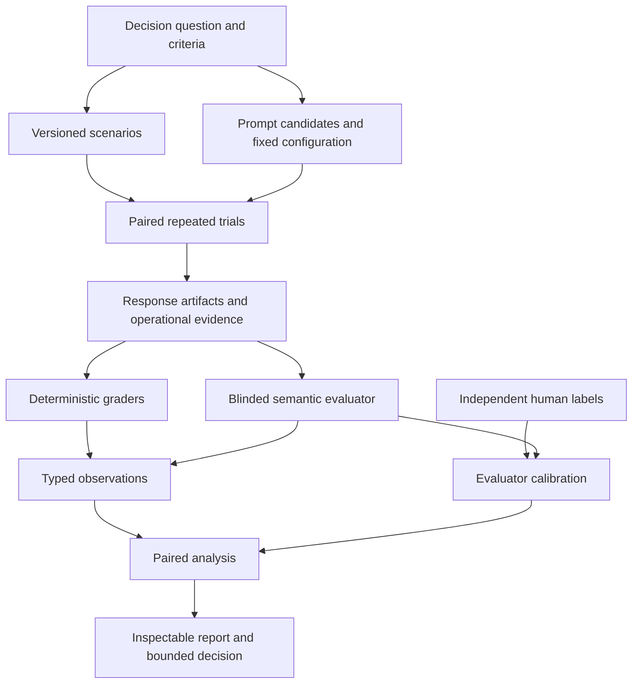

# Prompt evaluator specification

## Document status

- Status: Draft for review
- Scope: Product and behavioral specification for an experimental prompt evaluator
- Initial application: Rubber Duck tutoring prompts
- Intended use: Starting point for a separate implementation plan
- Related design: [prompt-evaluator-design.md](prompt-evaluator-design.md)
- System context: [current-system-evaluation-design.md](current-system-evaluation-design.md)
- Research basis: [research-synthesis.md](research-synthesis.md)

This specification defines what the evaluator must accomplish and what evidence it must preserve. It does not prescribe source-code structure, storage technology, command-line interfaces, or a final application architecture.

## 1. Product definition

The prompt evaluator is an experimental system for producing reproducible and inspectable evidence about behavior caused by prompt variants.

It evaluates prompt variants by running them on the same versioned scenarios under an otherwise fixed agent configuration. It applies declared behavioral criteria using deterministic checks, model-based evaluators, and human review where appropriate. It reports candidate differences, uncertainty, disagreements, failures, operational trade-offs, and the limits of the resulting claim.

The first version focuses on response-level tutoring behavior. It must be capable of growing into multi-turn conversation evaluation and integration with the Rubber Duck runtime without requiring the initial experiments to run through Discord.

## 2. Intended decisions

The evaluator should eventually support decisions such as:

- Whether a candidate tutoring prompt improves guidance and scaffolding over a baseline.
- Whether that improvement preserves subject accuracy.
- Whether the candidate increases inappropriate answer disclosure.
- Whether the available evidence is too weak or inconsistent to prefer either prompt.
- Whether a semantic evaluator is sufficiently aligned with human reviewers for a declared use.
- Which scenarios or learner situations account for improvements and regressions.

The evaluator does not choose or deploy a prompt automatically. It produces evidence for a human-owned prompt decision.

## 3. Normative language

The terms **must**, **should**, and **may** describe required, recommended, and optional behavior in this specification.

## 4. Core principles

### 4.1 Behavior is the evaluation target

The evaluator must measure observable behavior produced by the prompt within a declared agent configuration. Static inspection of prompt text may supplement the experiment but cannot establish behavioral quality.

### 4.2 Prompt-only claims require treatment isolation

A comparison may be called a prompt comparison only when the prompt or resolved prompt bundle is the declared treatment. Model identity, reasoning and generation settings, tools, output contracts, scenario versions, trial policy, graders, and application behavior must be held constant or deviations must invalidate or relabel the claim.

### 4.3 Evidence remains multidimensional

Subject accuracy, guidance, answer disclosure, cost, latency, and failures must remain distinguishable. The evaluator must not require a universal aggregate prompt-quality score.

### 4.4 Evaluators are measurement instruments

A model-based evaluator must not be treated as ground truth. Its supported uses must be established through comparison with independently created human labels from the relevant domain.

### 4.5 Conclusions are bounded

Reports must state the prompts, model, scenarios, criteria, evaluator versions, trial policy, and population to which the conclusion applies. Results must not imply universal prompt superiority.

### 4.6 Experimental flexibility is required

The evaluator must support small offline experiments before full runtime integration. Components, grader protocols, and execution modes may be replaced as evidence reveals weaknesses. Saved evidence should remain analyzable when an execution or grading component changes.

### 4.7 Integration remains an intended outcome

Experimental flexibility must not prevent later integration with Rubber Duck. The evaluator should use the same resolved prompts and completion behavior as the application when the experiment claims application relevance. Differences between experimental and deployed execution must be recorded.

### 4.8 Positive controls, negative controls, and no-effect controls are required

Before the evaluator is trusted on a subtle prompt difference, it must detect at least one known behavioral defect, recognize at least one clear improvement where feasible, and avoid inventing a difference between behaviorally equivalent candidates. These controls test the evaluation method rather than establish production prompt quality.

## 5. Scope

### 5.1 Initial scope

The first experimental version must support:

- At least two prompt candidates.
- Fixed response-level scenarios containing a learner message or conversation prefix.
- A shared model and agent configuration across candidates.
- Repeated candidate responses for stochastic behavior.
- Subject accuracy, guidance/scaffolding, and answer disclosure criteria.
- Deterministic observations where a valid executable rule exists.
- Structured model-based semantic evaluation.
- Import or association of independent human labels.
- Evaluator calibration analysis.
- Paired prompt comparison with an inconclusive outcome.
- Inspectable raw and derived evidence.

### 5.2 Later scope

The conceptual model must be extensible to:

- Multi-turn scripted or branching conversations.
- Simulated or human user drivers.
- Tool-using candidates and trace evaluation.
- Workflow and outcome checks.
- TesterBot and Discord end-to-end execution.
- Additional agent types and criteria.

### 5.3 Out of scope for the first experiment

- Automatic prompt optimization.
- Autonomous prompt deployment.
- A universal tutoring-quality score.
- Claims about student learning outcomes from transcript quality alone.
- Requiring live Discord execution for response-level evaluation.
- Treating feedback scores or evaluator rationales as unquestioned ground truth.
- Final production monitoring and governance workflows.

## 6. Terms

- **Prompt candidate:** A prompt or resolved prompt bundle included in the comparison.
- **Agent configuration:** The model, prompt, settings, tools, output contract, and relevant execution behavior that produce a response.
- **Treatment:** The deliberate difference between candidates. In this specification, the treatment is normally the prompt.
- **Criterion:** A declared behavior to measure, including its scale and evidence needs.
- **Scenario:** A versioned learner situation supplied identically to prompt candidates.
- **Trial:** One execution of one candidate on one scenario.
- **Response artifact:** The observable candidate output and associated operational evidence from a trial or curated historical example.
- **Grader:** A deterministic procedure, model-based evaluator, or human reviewer that produces an observation.
- **Observation:** A typed measurement or finding tied to evidence and grader provenance.
- **Calibration case:** A response artifact with independently assigned human labels used to evaluate a semantic grader.
- **Evaluation run:** A declared collection of candidate trials and grader executions.
- **Comparison:** Analysis of candidate observations on paired scenarios.
- **Decision policy:** Predeclared rules for interpreting comparison evidence.
- **Guardrail:** A criterion whose unacceptable regression can block a positive decision on the primary measure.

## 7. Conceptual workflow

The workflow may execute as a standalone experiment, through a local application adapter, or eventually through a deployed-style runner. These execution choices must not change the meaning of the evidence concepts.

## 8. Evaluation declaration

Every evaluation run must begin from a declaration that identifies:

- The decision question.
- The prompt treatment being compared.
- The candidate prompts and complete fixed agent configuration.
- The scenario set and scenario versions.
- The target population, sampling method, inclusion rules, and limits of any convenience sample.
- Primary criteria and guardrails.
- Which result is confirmatory and which analyses or slices are exploratory.
- Trial repetitions, ordering, limits, and stopping rules.
- The execution protocol, environment fixture, reset policy, cache behavior, and relevant time/provider controls.
- Graders and grader versions.
- Human-calibration status.
- Comparison method and decision labels.
- Missing-data, exclusion, abstention, retry, and candidate-failure policies.
- The independent sampling unit and clustering or grouping rules.
- Practical margins, evidence-sufficiency rules, grader-qualification thresholds, and hard-failure classes.
- Any multiple-comparison policy.
- Privacy classification and evidence-retention expectations.
- Known limitations.

The declaration must be frozen for a validation run. Changes create a new evaluation version.

## 9. Prompt candidates

### 9.1 Identification

Each candidate must have a stable identity and an immutable representation of its resolved prompt content. A label alone is insufficient because prompt files and included fragments may change.

Candidate provenance must include the model/provider identity, relevant settings, tools, output contract, and application or completion behavior needed to interpret the result.

### 9.2 Fair comparison

Before running a prompt-only comparison, the evaluator must verify that non-prompt candidate properties match. If they do not match, the run must be rejected as a prompt-only comparison or explicitly described as a broader candidate comparison.

### 9.3 Label masking and blinding limits

Candidate names, expected winners, prompt text, and historical feedback scores must be hidden from semantic evaluators and human reviewers unless a declared criterion specifically requires that information. This is label masking rather than guaranteed blinding: response style or content may reveal candidate identity. Qualification must include style-normalized counterfactual probes and document any identity cues reviewers or evaluators could infer.

## 10. Scenarios

### 10.1 Required content

A response-level scenario must contain enough information to reproduce the learner situation:

- A stable scenario identity and version.
- The learner message or model-visible conversation prefix.
- Subject or task reference material needed for accuracy evaluation.
- Reference provenance, review status, known incompleteness, and accepted alternative solutions where applicable.
- Applicable criteria.
- Constraints on permitted help or solution disclosure.
- Relevant slice labels.
- Source and review provenance.
- Source-group identity, history producer, and provenance for prior assistant turns.
- Data partition designation.

The scenario must distinguish model-visible input from evaluator-only reference information.

### 10.2 Historical conversations

Reviewed Rubber Duck conversations may seed scenarios and calibration cases. A high feedback score must be treated as a discovery signal rather than a criterion label.

Historical material must pass a source-completeness gate confirming ordered learner and tutor turns, roles, visible delivered content, and relevant tool events. Incomplete sources must be marked unusable rather than reconstructed through assumptions. Material that passes the gate must be redacted according to the approved policy and assigned a derived scenario identity. Original assistant responses may be retained as response artifacts but must not become mandatory reference answers merely because they received positive feedback.

The current downloaded export does not pass this gate for the 43 linked five-star standard-tutor threads: the linked rows omit the `function_call` arguments containing most tutor-visible messages. A different transcript source or new instrumentation is required before those conversations can supply full checkpoints.

### 10.3 Coverage

The initial scenario set should contain:

- Clear positive examples.
- Clear negative examples.
- Borderline examples.
- More than one subject or learner situation where feasible.
- Cases in which criteria are not applicable or evidence is insufficient.

Scenario coverage and omissions must be visible in the report.

The experiment must state whether the set is a convenience case set or a sample intended to represent a learner population. A small curated set may support evaluator and framework feasibility claims, but it must not support population-wide prompt claims.

### 10.4 Partitioning

Rubric development, evaluator development, sealed evaluator qualification, prompt development, and prompt validation material must be distinguishable. All turns, paraphrases, controlled edits, and adjacent cases from the same source conversation or learner must remain in one partition.

A semantic-evaluator protocol must be frozen before it is measured on the evaluator-qualification set. Prompt candidates, criteria, thresholds, and analysis must be frozen before a validation comparison. Development-set prompt comparisons are framework smoke tests and cannot support `better` or `not worse` deployment claims.

## 11. Trials and response artifacts

### 11.1 Paired execution

Every prompt candidate must receive the same versioned scenario input under equivalent conditions. Candidate order should be interleaved or randomized to reduce time-related provider effects.

The experiment must record an execution-protocol identity. Execution mode is a stratification variable, not merely report metadata. Prompt results from different protocols must not be pooled until a bridge study shows that the protocols construct equivalent model inputs and user-visible outputs for the claim being made.

Mutable tools, containers, caches, external services, and conversation state must be reset or isolated according to the declared environment policy. Carryover between candidates is a protocol deviation unless it is an explicit part of the scenario.

### 11.2 Repetition

The evaluator must support repeated trials because identical requests can produce different behavior. Repetition counts must be recorded, and repeated outputs must remain separate rather than being overwritten by a selected best response.

### 11.3 Evidence preservation

For each execution protocol, the evaluation declaration must identify the evidence required for a valid trial. At minimum, a response-level generated trial must durably preserve:

- Candidate and scenario provenance.
- Repetition number and execution order.
- Observable request configuration.
- Raw observable response items.
- Parsed user-facing response or tool request.
- Token usage, latency, retries, and provider metadata.
- Error and timeout information.
- Trial status and invalidation reason.
- Execution-protocol and adapter identity.
- Canonical request and response digests.
- Code/application revision and relevant dependency/provider identifiers.
- Environment, tool, data, and cache provenance applicable to the trial.

Hidden model reasoning must not be requested or stored as evaluation evidence.

A trial is invalid when evidence required by its execution protocol is not durably stored. Analysis reproducibility from saved evidence must be distinguished from the stronger and often unavailable claim that a provider response can be regenerated identically.

### 11.4 Execution modes

The evaluator may support several execution modes:

- **Recorded response:** Grade an existing reviewed response without generating a new one.
- **Standalone completion:** Generate a response without Discord using the application's completion behavior.
- **Local application:** Run through local conversation or tool behavior where needed.
- **Discord end-to-end:** Run through TesterBot and Discord for transport-specific or full-composition questions.

Reports must identify the execution mode. Evidence from different modes must not be represented as directly equivalent without validation.

Recorded historical prefixes estimate response quality conditional on those prefixes. If prior assistant turns were generated by a baseline prompt, results must not be described as whole-conversation behavior of another prompt. Neutral or independently authored prefixes should be included as a sensitivity check when whole-prompt interpretation matters.

## 12. Initial criteria

### 12.1 Guidance and scaffolding

Guidance/scaffolding is the initial primary semantic criterion.

It asks whether the response gives an appropriate next step for the learner's demonstrated state while preserving productive learner work. Its rubric must use behavioral anchors that distinguish harmful or absent guidance, weak guidance, useful guidance, especially effective guidance, and insufficient evidence.

### 12.2 Subject accuracy

Subject accuracy is a correctness guardrail.

It asks whether factual, technical, and task-specific claims in the response are correct given the available reference information. Its rubric must distinguish incorrect, partially correct, correct, and insufficient-evidence cases.

Accuracy assessment must not require a model evaluator when a reliable executable or expert reference oracle is available.

### 12.3 Answer disclosure

Answer disclosure is a pedagogical guardrail.

It asks whether the response reveals more of the solution than the scenario permits. Its rubric must distinguish prohibited disclosure, excessive help, appropriate help, not applicable, and insufficient evidence.

Disclosure cannot be judged from response length alone. The scenario must state the learner's progress and permitted level of help.

### 12.4 Separation of criteria

The three criteria must be reported separately. A positive scaffolding result must not erase an accuracy or disclosure failure. Any combined decision must come from a declared policy rather than an implicit average.

## 13. Graders

### 13.1 Common requirements

Every grader must identify:

- The criterion or property it measures.
- The evidence it requires.
- Its output scale.
- Its version and relevant configuration.
- Conditions under which it abstains, returns not applicable, or fails.

Every observation must retain its grader provenance and point to supporting evidence.

### 13.2 Deterministic graders

Deterministic graders should be used for properties with valid executable or exact oracles, including structured-output validity, tool constraints, exact task results, and operational measurements.

A deterministic check must describe the bounded property it verifies. Passing it must not be interpreted as proof of semantic tutoring quality.

### 13.3 Semantic evaluator

The semantic evaluator must:

- Produce structured criterion-level observations.
- Use behavioral anchors rather than an undefined general-quality score.
- Be blind to candidate identity and expected outcome.
- Cite evidence from the supplied response or conversation.
- Support abstention when evidence is insufficient.
- Keep concise rationale separate from the measured value.
- Preserve failures and invalid outputs rather than silently retrying until a desired judgment appears.
- Be versioned by evaluator model, instructions, rubric, evidence format, and relevant settings.
- Treat learner messages, references, tool outputs, transcripts, and candidate responses as untrusted quoted evidence rather than instructions.
- Run in a fresh isolated invocation without shared candidate state, hidden candidate metadata, or write-capable tools for the initial experiment.
- Receive evidence through distinct typed fields or equivalently unambiguous boundaries.
- Ignore candidate self-descriptions and rubric vocabulary as evidence that a criterion is satisfied.

The evaluator may grade criteria in separate calls or a combined structured call. The chosen protocol must be evaluated for reliability and must preserve criterion-level results.

Evidence citations must resolve mechanically to content supplied to the evaluator through an artifact identity and a verifiable span or item reference. Fabricated, changed, or out-of-scope citations make the observation unsupported or the grader execution invalid.

Before receiving supported use beyond exploration, the evaluator must pass a declared injection suite covering instructions embedded in candidate responses, learner text, references, fake system messages, delimiter escapes, structured-data injection, and rubric impersonation.

Evaluator provenance must include execution time, evaluator-instruction digest, settings, and resolved provider revision or fingerprint when available. Decision-grade grading must interleave candidates within a bounded window and run immutable sentinel cases at the start and end of a batch. The declaration must define how detected drift invalidates or restarts grading; observations from materially different grader behavior must not be pooled.

### 13.4 Pointwise and pairwise grading

The initial system should permit both approaches:

- Pointwise grading measures each response against criterion anchors.
- Pairwise grading compares two blinded responses for a criterion.

Pairwise grading must counterbalance response order using independent calls. Every decision-critical pair should be graded in both orders unless a sampled order-swap protocol was frozen before the run. A judgment that reverses when order is swapped must remain visible as inconsistency or abstention rather than being forced into a winner.

### 13.5 Grader failures

Grader errors, malformed outputs, and missing evidence must be distinguished from candidate failures. Saved response artifacts should be gradeable again without rerunning the candidate.

Candidate-generation and grader retry budgets and permitted retry reasons must be declared separately. A valid judgment must not be retried because of its value. All attempts must remain linked to the same grader execution and must not be counted as independent evidence.

## 14. Human review and evaluator calibration

### 14.1 Human labels

Human labels used for calibration must be created independently of semantic-evaluator output. Reviewers should receive anchored criteria, evidence, examples, and an abstention or not-applicable path.

Reviewer identity may be pseudonymous in evaluation artifacts but reviewer expertise and protocol version must be documented.

Confirmation cases must receive labels from at least two blinded domain reviewers on an overlapping set sufficient to measure agreement. Individual labels must be preserved. Reviewer training, anchor checks, prior exposure to source conversations or candidate prompts, and the adjudication protocol must be documented.

### 14.2 Calibration evidence

Calibration must examine:

- Overall and criterion-level agreement.
- Class-level errors, especially severe false passes.
- Repeated-evaluation consistency.
- Pairwise order sensitivity.
- Sensitivity to verbosity and superficial style.
- Self-preference and generator/evaluator family effects where feasible.
- Prompt-injection susceptibility in candidate responses.
- Performance across important scenario slices.
- Human disagreement and ambiguous cases.

Raw agreement alone is insufficient when one rating dominates the dataset. Content-preserving probes should cover concise versus padded responses, plain versus polished formatting, confident versus cautious tone, and rubric words inserted without improved behavior.

### 14.3 Supported use

Calibration results must lead to a documented supported use for each evaluator criterion. Possible supported uses include exploratory analysis, triage, decision evidence with human sampling, or no supported use.

Criterion-specific qualification thresholds must be declared before the sealed evaluator-qualification set is opened. They must address uncertainty, severe false-pass rates, gradable coverage, abstention, and important slices. A criterion that fails qualification cannot produce `better`, `not worse`, or `worse`; it may support exploratory reporting or be replaced by human review.

A semantic evaluator must be recalibrated after material changes to its model, instructions, rubric, evidence presentation, or output scale.

## 15. Observations

An observation must contain:

- The trial or calibration response it measures.
- The criterion or property identifier.
- A typed value on the declared scale.
- Status such as observed, abstained, not applicable, missing evidence, or grader error.
- Evidence references.
- Grader provenance.
- Timestamp and evaluation-run association.

Boolean, categorical, ordinal, numeric, and qualitative observations must remain distinguishable. Missing, abstained, and not-applicable observations must not be converted to failures or zero scores without a declared policy.

## 16. Comparison and uncertainty

### 16.1 Experimental unit

The scenario is the primary unit for prompt comparison. Repeated trials and multiple grader outputs from one scenario must not be treated as independent scenarios.

When multiple checkpoints derive from the same conversation, learner, or other source family, inference must account for that higher-level cluster. Checkpoints must not be counted as independent samples merely because they have distinct scenario IDs.

### 16.2 Required reporting

The comparison must report:

- Scenario counts and coverage.
- Trial and repetition counts.
- Missing, failed, invalidated, and excluded trials.
- Candidate results for each criterion.
- Paired candidate differences.
- Within-scenario and repeated-trial variation.
- Guardrail failures.
- Predeclared scenario slices.
- Tokens, latency, retries, and cost where available.
- Evaluator calibration status and limitations.
- Representative successes, failures, and disagreements linked to evidence.
- Candidate-specific failure, timeout, exclusion, abstention, not-applicable, and missing-evidence rates.
- Separate candidate-execution costs and evaluation/grading costs.

### 16.3 Decision labels

Decision labels must be assigned by an exclusive ordered procedure: validate protocol and provenance, verify evidence and qualified graders, apply hard guardrails, evaluate superiority or non-inferiority, and otherwise return worse or inconclusive according to the declared policy. Relevant uncertainty bounds, rather than point estimates alone, must clear predeclared practical margins.

The system must support at least:

- **Better:** The primary improvement satisfies the declared practical threshold and required guardrails.
- **Not worse:** The candidate satisfies declared non-inferiority conditions without establishing superiority.
- **Worse:** A primary or guardrail regression crosses a declared threshold.
- **Inconclusive:** Evidence is too sparse, uncertain, inconsistent, or weakly calibrated.
- **Invalid:** Treatment isolation, provenance, protocol, or execution failures prevent the requested claim.

The preliminary experiment may remain exploratory and omit a deployment recommendation while still producing useful evidence.

Candidate-caused failures and ungradable outputs must not disappear through exclusion. The declaration must distinguish exogenous protocol failures from treatment-dependent failures and state how each enters the decision. Applicability should be scenario-defined where possible; candidate-specific abstention or not-applicable rates must be treated as potential failure signals. Sensitivity analysis is required when missingness differs by candidate.

Ordinal criteria must be analyzed using estimands appropriate to ordered categories, such as category-transition tables, threshold rates, paired win probabilities, or an explicitly justified ordinal model. Arbitrary integer conversion and unqualified averaging are prohibited.

## 17. Reporting and inspectability

Every report must allow a reviewer to determine:

1. The decision question and treatment.
2. What was held constant.
3. Which scenarios and slices were evaluated.
4. Which criteria and graders were used.
5. Whether semantic graders were calibrated for this use.
6. The result for each criterion and guardrail.
7. The amount and source of uncertainty.
8. Which trials failed or were excluded and why.
9. Where candidate and grader disagreements occurred.
10. Which raw or redacted evidence supports each result.
11. The limitations and scope of the conclusion.

Machine-readable evidence and a human-readable report should describe the same run. Reports must not expose source Discord identifiers or other restricted information.

## 18. Failure and status model

Status must use orthogonal dimensions rather than one mutually exclusive field. It must distinguish at least:

- Lifecycle: pending, running, finished, or cancelled.
- Validity: valid, invalid, or excluded, with a reason.
- Candidate outcome: response, tool request, conversation completion, or no output.
- Failure stage: setup, adapter, provider, parser, tool, driver, transport, storage, grader, or human review.
- Retry events and terminal error.
- Missingness or censoring reason.

Retries must remain observable. A successful retry must not erase the original failure event or inflate the number of independent trials.

## 19. Privacy and data use

Before historical conversations are converted into evaluation assets, the project must establish whether the exports are approved for this use and whether their content may be sent to evaluator models.

Derived scenarios and ordinary reports must not contain Discord guild, channel, thread, user, or reviewer identifiers. Source linkage, when required, must be access-controlled separately from derived evaluation IDs.

The evaluator must support redaction, retention, and deletion rules appropriate to the data. Candidate outputs and evaluator rationales inherit the sensitivity of their source scenario.

Every data source used in an experiment must have a privacy manifest specifying permitted purpose, data classes, local and external processing rules, provider retention settings, egress restrictions, access roles, retention dates, and deletion lineage. Missing approval is a hard stop. Redaction must address identifying content and secrets, not only platform identifiers. Deletion of a source must propagate to derived scenarios, candidate outputs, grader artifacts, and reports or leave an appropriate non-content tombstone where lineage must be preserved.

## 20. Experimental operation and evolution

### 20.1 Replaceable experiments

Early runners, grader prompts, reports, and artifact stores may be prototypes. The project should prefer small experiments that expose invalid assumptions before committing to permanent infrastructure. Early evidence formats should use a small versioned envelope with extensible payloads and permit migration, supersession, redaction, and deletion lineage.

### 20.2 Durable concepts

Even when experimental components are replaced, the project should preserve stable identities and provenance for candidates, scenarios, trials, graders, observations, and comparison results.

### 20.3 Regrading and reanalysis

The system must permit saved response artifacts to be evaluated by a revised grader and saved observations to be reanalyzed under a revised comparison method without claiming that the new result is the original evaluation version.

### 20.4 Integration path

The first response-level experiments may run independently of the Discord application. Application integration should build on the standalone completion direction being explored on `origin/bean-ai-refactor` or its successor only after the adapter passes conformance testing. The branch currently does not send `Agent.prompt`, lacks required initialization, references mismatched Armory methods, cannot invoke current context-wrapped tools equivalently, and does not complete the production tool loop.

Adapter conformance must prove that the resolved candidate prompt is actually sent, the ordered model-visible history and settings match the declared trial, raw provider outputs and usage are preserved, and tool-loop ownership is explicit. A golden-trace bridge study must compare offline and application requests, history, tool behavior, user-visible response projection, termination, and errors before results are described as application-equivalent.

TesterBot remains a possible later runner for Discord-specific and complete-conversation evidence. It is not required for the first response-level experiment.

## 21. Initial experimental program

### 21.1 Experiment A: scenario and rubric feasibility

Obtain an approved, complete transcript source, then curate a small set of reviewed conversation checkpoints from high-rated historical conversations and add naturally occurring and controlled negative and borderline material. Apply the three initial criteria with human reviewers.

The experiment succeeds when the source-completeness gate passes and the team can identify the learner state, determine criterion applicability, apply anchored labels, and explain disagreements. It may reveal that the available exports, a criterion, or a recorded conversation are unusable for evaluation.

### 21.2 Experiment B: semantic-evaluator feasibility

Develop one or more restrained evaluator protocols on the evaluator-development set, freeze the selected protocol, and qualify it on sealed human-reviewed cases. Test pointwise criteria, pairwise order swaps, repeated judgments, injection attacks, and selected bias probes.

The experiment succeeds when the team can document the evaluator's error patterns and supported use. It does not require every criterion to meet a decision-grade standard.

### 21.3 Experiment C: prompt-comparison feasibility

Run a baseline and a purposeful prompt variant on the same development scenarios as a framework smoke test. Preserve repeated outputs and evaluate them using the calibrated portions of the protocol. Only a later frozen validation run may support a confirmatory prompt decision.

The experiment succeeds when every comparative result is traceable to saved evidence, failures are classified, and an inconclusive result is possible.

### 21.4 Experiment D: conversation extension

Extend selected scenarios to controlled multi-turn interactions with a scripted or branching learner. Add trace and conversation-level outcome evidence while retaining the response-level criteria.

## 22. Acceptance criteria for an initial prompt evaluator

An initial experimental implementation satisfies this specification when it can demonstrate that it:

- Declares a prompt-only comparison and verifies treatment isolation.
- Proves through adapter conformance evidence that each resolved prompt and declared history were actually sent to the candidate model.
- Runs at least two prompts on the same fixed scenarios with configurable repetitions.
- Operates without fabricated Discord context for response-level trials and semantic grading.
- Identifies its execution protocol and does not claim Discord/application equivalence without a bridge study.
- Preserves candidate, scenario, trial, grader, and execution provenance.
- Records raw observable responses and operational evidence.
- Produces separate accuracy, guidance/scaffolding, and answer-disclosure observations.
- Supports deterministic and model-based graders without conflating their evidence.
- Associates independent human labels with calibration cases.
- Separates evaluator development from sealed evaluator qualification.
- Enforces declared criterion-specific qualification thresholds before semantic results inform a prompt decision.
- Treats candidate and scenario content as untrusted evaluator evidence and passes the declared prompt-injection tests.
- Validates evidence citations against the supplied artifacts.
- Measures and reports evaluator disagreement, order effects, verbosity/style effects, and rubric-gaming controls.
- Regrades saved responses without rerunning prompt candidates.
- Reports paired results, clustered sample structure, candidate-specific missingness and failures, uncertainty, and representative evidence.
- Applies a frozen missingness, exclusion, retry, and candidate-failure policy.
- Keeps all derived checkpoints from a source family in one partition and analyzes the appropriate independent cluster.
- Uses development comparisons only as smoke tests and freezes a separate validation protocol before making confirmatory claims.
- Demonstrates known-bad, clear-positive where feasible, and no-effect controls.
- Returns an inconclusive or invalid result when required evidence is inadequate.
- Invalidates runs with insufficient gradable coverage or unqualified semantic graders for the intended decision.
- Protects source identifiers and follows the approved data-use rules.
- Can later add a conversation or Discord runner through versioned extensions or migrations while preserving evidence lineage; early schemas are allowed to change when experiments expose weak assumptions.

## 23. Questions to resolve before the implementation plan

The implementation plan needs decisions or working assumptions for:

- Approval and handling rules for historical conversation data.
- A complete transcript source; the current feedback-linked message export is insufficient.
- The initial 6–10 complete conversations and naturally occurring or controlled negative/borderline examples.
- Human reviewers and labeling protocol.
- Final behavioral anchors for the three criteria.
- Baseline prompt and first purposeful candidate hypothesis.
- Candidate model and reasoning settings.
- Evaluator model/protocols to compare.
- Preliminary repetition count, budget, and stopping conditions.
- Target population, sampling/coverage rules, independent cluster, and confirmatory outcome.
- Practical decision margins, hard-failure rules, grader-qualification thresholds, or an explicitly exploratory report.
- Missingness, exclusion, applicability, retry, and candidate-failure policies.
- Which revision of the completion refactor can pass the required conformance and bridge tests.
- Where experimental evidence may be stored and for how long.

These choices may change after the first feasibility experiment. The implementation plan should identify which decisions are provisional and which are required for reproducibility.
