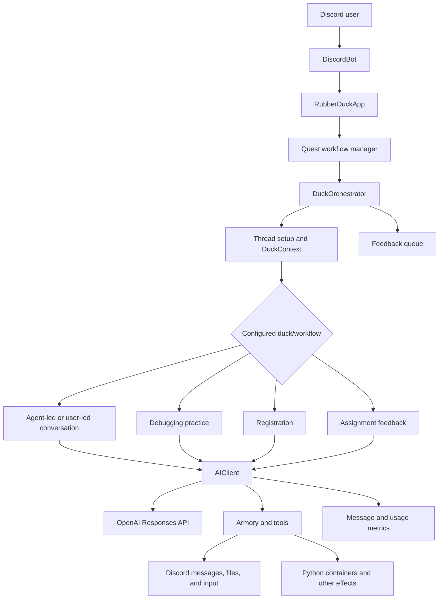
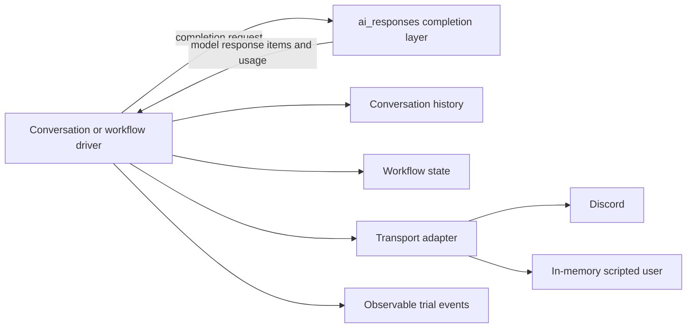
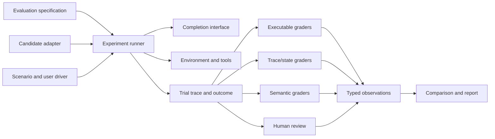

# Rubber Duck evaluation strategy: system map and experimental directions

## Document status

- Status: Working strategy, updated for the current evaluation prototypes
- Purpose: Describe the Rubber Duck system, identify what can be evaluated at each layer, assess the current testing approach, and guide incremental framework implementation.
- Current implementation focus: Standard Rubber Duck prompt quality, first for one response and then for complete conversations. Other workflows remain in the system map so the contracts do not prevent later reuse.
- Scope: Architecture and experiment direction. Production experiments still require an explicit decision and appropriate review.
- Related documents:
  - [Research synthesis](research-synthesis.md)

## 1. Problem statement

The original request was to evaluate prompts. In Rubber Duck, a prompt does not act by itself. Observable behavior is produced by a configured system containing a model, prompt, tools, model-call loop, conversation history, workflow logic, Discord transport, and user behavior.

The same visible failure can originate in different layers. Examples include:

- A weak tutoring response may come from the prompt, model behavior, missing conversation history, or an unrealistic simulated learner.
- An incorrect statistics answer may come from dataset selection, tool arguments, executed code, result interpretation, or explanation quality.
- An incomplete workflow may come from model tool choice, controller logic, an illegal state transition, timeout handling, or Discord event delivery.
- An early ending may come from a model-requested conclusion, a completion signal, a timeout, or an upstream error.

A transcript can reveal the visible symptom. It usually cannot identify the responsible component unless the trial also records the relevant events, state, and configuration.

The framework must therefore support two related claims:

1. **Prompt comparison:** Prompt A and Prompt B are evaluated while the model, tools, workflow, scenarios, environment, and graders are held constant.
2. **Agent-system evaluation:** A complete candidate configuration is evaluated, including its prompt, model, tools, controller, workflow, environment, and user interaction.

Prompt comparison should be the first supported product use case. The evidence model must still preserve enough system information to explain failures and support broader comparisons.

## 2. Current system

### 2.1 Runtime flow

### 2.2 Current components and responsibilities

| Component | Current responsibility | Evaluation-relevant behavior |
|---|---|---|
| `DiscordBot` / `RubberDuckApp` | Convert and route Discord events | Correct routing, duplicate or lost events, reaction routing |
| Quest workflow manager | Start workflows, deliver events, preserve workflow history | Workflow identity, event ordering, resume behavior, persistence failures |
| `DuckOrchestrator` | Select a duck, create a thread, construct `DuckContext`, handle errors, close the conversation, enqueue feedback | Correct duck selection, thread lifecycle, error classification, close timing |
| `DuckContext` | Carry guild, channel, thread, user, message, and timeout information | Correct addressing, isolation between users/threads, timeout configuration |
| Conversation classes | Connect agent turns to message input/output | History ownership, turn sequencing, user wait behavior, termination |
| `AIClient` | Call the model, manage the local model-visible history, execute tools, validate structured output, record usage/messages, retry some failures | Request construction, tool loop correctness, history correctness, output parsing, retry behavior, termination flags |
| `Agent` configuration | Identify prompt, model, tools, tool choice, output format, and reasoning setting | Complete candidate provenance and controlled treatment |
| `Armory` | Register tools, generate schemas, inject `DuckContext`, execute tool implementations | Tool availability, schema correctness, argument validity, authorization, side effects |
| `TalkTool` | Send/receive Discord messages and conclude conversations | Delivery, missing input, timeout, termination invocation |
| Domain workflows | Implement registration, debugging practice, statistics assistance, and assignment feedback | Domain state, legal transitions, correctness, completion criteria |
| SQL metrics/storage | Record selected messages, usage, feedback, and workflow state | Evidence completeness, linkage, retention, candidate/scenario provenance; current exports omit standard-tutor function-call arguments and serialize some events as Python strings |

### 2.3 The overloaded meaning of context

The current code uses related terms for different data:

- **Discord context:** `DuckContext`, containing guild, channel, thread, author, initial message, and timeout data.
- **Conversation history:** messages and model/tool response items supplied to the model.
- **Workflow state:** durable progress such as registration fields or debugging-practice priorities.
- **Evaluation context:** candidate, scenario, trial, environment, and grader provenance.

The design should use explicit names for these concepts. Candidate names are `DiscordContext`, `ConversationHistory`, `WorkflowState`, and `TrialContext`. Exact names can follow the application refactor, but these values should not share one unqualified `context` abstraction.

### 2.4 Completion-layer refactor status

The `origin/bean-ai-refactor` work separates standalone agent completions from Discord concerns. This is a useful boundary for evaluation because local trials and judges should be able to invoke a model without manufacturing a dummy Discord thread.

The intended responsibility split is:

The completion layer should accept model-visible inputs and return model-visible outputs and provider metadata. The driver should own conversation history, decisions about when to call the model again, message delivery, and termination. Tools may still require environment-specific services, but Discord identity should not be required by a tool that has no Discord behavior.

The current branch head now forwards the agent prompt, initializes its client and retry protocol, uses current Armory lookup methods, and executes ordinary tool calls. The earlier list of missing basics is therefore obsolete. It is still not established as a production-equivalent adapter: it has no conformance or parity suite, its termination behavior differs from the current `AIClient` path, and the tentative workflows have not demonstrated equivalent histories, tool effects, usage, errors, or close behavior. It must pass completion-adapter conformance and Standard Duck parity experiments before an evaluation can claim that it is testing deployed behavior.

### 2.5 Current Standard Duck evaluation paths

Standard Rubber Duck currently has two separate evaluation paths:

1. **Fixed-prefix, single-response evaluation.** `src/testing/prompt_evaluation/` resolves the production Standard Duck agent, converts a transcript prefix into Responses API history, calls the shared completion adapter with Armory-generated tool schemas, and applies independently configured semantic criteria.
2. **TesterBot Discord evaluation.** `tests/tester_bot_tests/test_dry_run.py` starts the application, uses a second Discord bot and model as the student, follows a complete conversation scenario, checks visible closure/error strings, reports selected cost, and applies a post-conversation model assessor.

These paths now share the provider-call boundary and resolved Standard Duck candidate, but they are not yet one evaluation system. They still use different history, result, grader, and reporting contracts. The standalone path does not use the production retry, typing, metrics, or tool loop. The Discord path exercises deployed composition but returns only TesterBot history and loses internal application events. Integration should make them two runners over common trial contracts rather than make either path depend on the other.

## 3. What must be evaluated

Evaluation begins with requirements. A component is not assigned a score merely because it exists. Each decision selects the relevant requirements, scenarios, measurements, and thresholds from the layers below.

### 3.1 Component evaluation matrix

| Layer | Questions | Evidence and measures | Suitable grader |
|---|---|---|---|
| Prompt and agent configuration | Does the candidate produce the desired behavior under fixed conditions? Does it follow tool and termination instructions? | Task success, instruction violations, premature termination rate, answer disclosure, robustness across paraphrases, tokens and latency | Paired scenarios; executable checks; calibrated semantic/human ratings |
| Completion layer | Is the provider request constructed correctly? Are all response item types, structured outputs, usage, errors, and retries handled correctly? | Contract pass rate, schema-validation rate, response-item preservation, retry/error classification, usage consistency | Unit and contract tests with fake/provider fixtures |
| Tool loop | Are tools selected and invoked correctly? Does every call receive a result? Are malformed arguments and failures handled? | Tool choice accuracy, argument validity, call/result pairing, redundant calls, recovery rate, forbidden calls | Trace assertions and executable tool fixtures |
| Conversation driver and history | Are the correct events retained and supplied in order? Does the driver wait, continue, and terminate correctly? | History completeness/order, duplicated turns, missing tool results, turn count, premature/late termination, timeout classification | State-machine or temporal trace checks |
| Domain workflow | Does the workflow reach a valid outcome through legal transitions? | Terminal state correctness, partial progress, skipped stages, invalid transitions, idempotency, recovery | State/outcome assertions and domain-specific checks |
| Transport and Discord integration | Do messages reach the correct channel/thread and do incoming events reach the correct workflow? | Routing correctness, delivery failures, duplicates, ordering, time to first response, thread lifecycle | Mock transport tests plus selective Discord end-to-end tests |
| Complete agent system | Does the user goal succeed under representative conditions without critical violations? | Scenario success, reliability across repetitions, guardrails, cost, latency, failure categories, important slices | Multiple typed graders and a declared decision policy |
| Semantic evaluator | Does the judge measure the intended quality reliably? | Human agreement, precision/recall by class, abstention, repeated-run consistency, order/verbosity/injection sensitivity | Independently labeled calibration set and metamorphic tests |
| Production behavior | Does deployed behavior match the validated population, and are new failures appearing? | Operational failures, drift, feedback, incidents, sampled quality, distribution changes | Monitoring and reviewed samples; not controlled causal comparison |

### 3.2 Measurement types

The framework needs typed observations because the following measurements are not interchangeable:

- **Boolean invariant:** A forbidden tool was called; a required result is missing.
- **Categorical outcome:** Completed, timed out, provider error, workflow error, user abandonment.
- **Numeric measure:** Cost, latency, token count, calls, turns, percentage correct.
- **Ordinal rating:** Scaffolding quality on an anchored scale.
- **Qualitative finding:** A reviewer identifies an unexpected harmful or confusing behavior.

Critical invariants should act as hard gates. Trade-off measures such as helpfulness, latency, and cost should remain visible separately. A high average quality score must not cancel an unauthorized action or severe correctness failure.

### 3.3 Workflow-specific profiles

#### Standard and Socratic tutoring

- Subject-matter correctness and honest uncertainty.
- Diagnosis of the learner's current understanding.
- Appropriate scaffolding and hint progression.
- Premature solution or answer disclosure.
- One-question pacing and clarity.
- Appropriate continuation and termination.
- Learner effort, successful self-correction, and later learning outcomes where feasible.

#### Statistics assistance

- Dataset selection and metadata use.
- Statistical method appropriateness and assumption checking.
- Executed code and numerical correctness through independent recomputation.
- Tool argument and result handling.
- Artifact delivery and reproducibility.
- Explanation accuracy and clarity.

#### Debugging practice

- Correct tracking of concept, location, intent, and fix priorities.
- Recognition of complete, incomplete, incorrect, and unrelated student responses.
- Legal progression through priorities and exercises.
- Feedback targeted to the active misconception.
- Completion only after declared conditions are satisfied.

#### Registration

- Identity and email validation before protected effects.
- Legal ordering of nickname and role changes.
- Correct final state and side effects.
- Permission failure, retry, timeout, and escalation behavior.
- Idempotency and safe resumption.

#### Assignment feedback

- Project detection and input validation.
- Rubric coverage and evidence linkage.
- Correct structured output and missing-section handling.
- Actionability and domain-expert agreement.

## 4. Cross-layer diagnosis examples

### 4.1 Semantic tutoring quality

Example requirement:

> When a learner presents an incorrect attempt, the tutor should identify the relevant misconception and provide a next step that advances the learner without immediately supplying the complete solution.

Evidence may include the learner's attempt, model-visible history, prompt and model configuration, tutor response, later learner response, and human or calibrated semantic ratings. A trace can establish which history the model saw. Human or semantic evidence is still required to judge whether the response was pedagogically appropriate.

### 4.2 Statistics correctness

Example requirement:

> When asked for a numerical analysis, the agent should use the correct dataset and method, produce a reproducible result, and explain it accurately.

The outcome can be independently recomputed. The trace can check dataset selection, tool arguments, code, and tool results. A semantic grader or reviewer can assess whether the explanation accurately represents the calculation and its assumptions.

### 4.3 Conversation completion

Example requirement:

> The standard tutor may conclude only after the learner explicitly ends the conversation or the declared completion condition has been observed.

Useful trace events include:

1. User message received.
2. Conversation history updated.
3. Completion requested with candidate and prompt digest.
4. Model returned `conclude_conversation` tool call.
5. Tool arguments validated.
6. Tool raised or returned a conversation-complete signal.
7. Driver transitioned to completed.
8. Orchestrator sent the closed message.

This supports several distinct observations:

- **Prompt/agent observation:** The model requested termination without transcript evidence satisfying the rule.
- **Tool-loop observation:** The completion signal was interpreted according to the tool contract.
- **Driver observation:** The driver stopped after the completion transition.
- **Discord observation:** The closed message was sent once to the correct thread.
- **System outcome:** The learner's task remained incomplete when the conversation ended.

The first observation may indicate a prompt or model-behavior problem. The remaining observations can show whether the application correctly executed the model's request. Completion is therefore one useful cross-layer diagnostic case rather than the organizing goal of the framework.

## 5. Current testing system

### 5.1 Existing layers

The repository currently contains:

1. **Unit and regression tests** for SQL metrics, dataset tools, Python output formatting, rubric generation, response/tool completion behavior, structured output validation, and retry paths.
2. **A fixed-prefix Standard Duck response evaluator** with four YAML cases, the resolved production agent and tool schemas, anchored semantic criteria, structured evaluator output, and fake-client plumbing tests.
3. **TesterBot end-to-end tests** that start the Rubber Duck application, connect through Discord, use a model-driven tester as the user, collect a visible conversation history and selected usage/cost, and run post-conversation model assessors.
4. **Four current Discord dry runs** covering the Standard Duck, general statistics duck, CS statistics duck, and debugging-practice workflow.
5. **A debugging assessor battery** that applies several criteria independently rather than relying only on one broad prompt.

### 5.2 What the current tests establish

- Important local contracts work for the specifically tested cases.
- A Standard Duck response can be generated after a fixed prefix and graded independently on subject accuracy, misconception diagnosis, scaffolding, answer disclosure, relevance, and actionability.
- Configured semantic ratings map deterministically to pass, fail, or inconclusive outcomes, although the validity of the selected rating remains unproven.
- The deployed-style application can start and interact through Discord.
- A model-driven test conversation can reach the application's close message without the orchestrator error marker.
- Existing transcript assessors can return structured pass/fail results.
- Token usage and estimated cost can be collected for the TesterBot and Rubber Duck sides.

### 5.3 What the current tests do not establish

- Whether one prompt is better than another under a controlled treatment; the fixed-prefix evaluator currently executes one prompt candidate at a time.
- Reliability across repeated stochastic trials.
- Whether the scenario suite represents actual or intended use.
- Whether the simulated student behaves like a real learner.
- Whether the model assessor agrees with expert humans or is sensitive to order, verbosity, self-preference, or prompt injection.
- A blinded common-policy comparison. The fixed-prefix judge currently receives the candidate's full tutor prompt, and at least one criterion grades compliance with that prompt's own boundaries; prompt variants could therefore be judged against different goalposts.
- Which component caused a failure visible in the transcript.
- Tool and workflow trace correctness when the transcript omits internal events.
- Confidence intervals, practical effect size, or an inconclusive comparison.
- Candidate, scenario, grader, and environment version provenance sufficient for reproduction.
- Complete production parity for the fixed-prefix response call. It now shares the candidate request adapter, but does not use the production retry/metrics wrapper or deployed initial history, and it collapses raw response actions into one transcript message.
- A durable result artifact. Fixed-prefix results print to the terminal; Discord transcripts normally require inspection in Discord.
- A distinct Discord trial status for normal completion, timeout, maximum turns, driver cancellation, provider error, and workflow error.
- Complete reconstruction of current standard-tutor conversations from the downloaded metrics export; the tutor's visible `talk_to_user` arguments are absent.

### 5.4 Recommended role for TesterBot

TesterBot should be retained as a high-fidelity Discord runner and one possible simulated-user driver. It should implement the same candidate, scenario, trial, trace, outcome, and observation contracts as local runners.

It should not define the framework's data model or be required for component evaluations. Live Discord adds useful coverage for routing, message queues, permissions, thread lifecycle, and deployed composition, while also adding latency, credentials, side effects, flakiness, and simulator dependence.

For Standard Duck specifically, the current runner also needs stricter correlation between the opener, thread notification, and collected messages; an explicit termination reason; a readable persisted transcript; close-event handling that does not wait through a full idle timeout; and cost accounting that states whether grading calls are included.

## 6. Proposed evaluation architecture

### 6.1 Stable experiment concepts

The common model should use:

- **Candidate:** The fully identified system configuration under test. A prompt variant is one possible treatment within a candidate.
- **Requirement:** The behavior or property to measure and its scope.
- **Scenario:** Initial input, state, fixtures, user driver, limits, and slice labels.
- **Trial:** One candidate execution on one scenario.
- **Trace:** Ordered observable events from the trial.
- **Outcome:** Final external state and artifacts.
- **Grader:** A procedure or reviewer that creates an observation from evidence.
- **Observation:** A typed result with evidence and provenance.
- **Comparison:** Paired analysis across candidates and scenarios.
- **Decision policy:** Predeclared rules that interpret evidence for a particular decision.

### 6.2 Replaceable interfaces

Local drivers, TesterBot, Discord, the shared completion adapter, model judges, and deterministic graders can change independently if they implement explicit contracts.

### 6.3 Standard Duck vertical slice and completion hook

The first integrated framework slice should support the same resolved Standard Duck candidate at three fidelity levels:

1. **Single response:** Generate one action after a fixed model-visible history.
2. **In-memory conversation:** Run multiple turns with a scripted, branching, or model-driven learner and no Discord dependency.
3. **Discord conversation:** Run the same candidate and compatible scenario through TesterBot and the deployed application composition.

The integration point should be the model completion boundary, not Discord and not the evaluator. A minimal boundary is:

- **Completion request:** resolved candidate identity, instructions, model-visible history, actual tool schemas, tool choice, reasoning/output settings, and request metadata.
- **Completion result:** raw response items, usage, provider/model metadata, timing, retry/error information, and no evaluator verdict.
- **Completion observer:** an optional hook that records requests and results as trial events without changing application behavior.

The production `AIClient` and standalone evaluator now use the same completion adapter. The single-response runner calls it once without invoking the blocking Discord implementation of `talk_to_user`. It still needs to preserve whether the result requested `talk_to_user`, requested `conclude_conversation`, returned a direct message, or produced an invalid/unsupported action instead of immediately collapsing that evidence into transcript text.

This is being introduced incrementally; steps 1 and 3 are implemented:

1. Extract or adapt the provider-request portion of `AIClient._get_completion` behind the completion contract while leaving the current production tool loop intact.
2. Add conformance tests for exact instructions, history, tool schemas, reasoning settings, raw response preservation, usage, retries, and errors.
3. Migrate the fixed-prefix evaluator to this adapter and to the actual resolved Standard Duck agent/tool configuration.
4. Add the optional observer to the existing Standard Duck path so Discord trials emit the same completion events.
5. Move `talk_to_user` action handling into a reusable conversation driver only after request/response parity is established. The driver can then deliver through an in-memory or Discord transport and append the learner reply as the tool result.

The evaluator must remain outside the completion hook. Graders consume the completed `Trial`; they do not run inside the application call path. This keeps standalone generation, deployed behavior, and grading replaceable.

### 6.4 State machines

State machines have three useful roles:

1. **Experiment lifecycle:** Declared → validated → prepared → running → completed/failed → graded → analyzed → reported.
2. **Trial and driver lifecycle:** Waiting for input → requesting completion → executing tools → delivering output → waiting/complete/error.
3. **Domain and policy monitors:** Registration transitions, debugging-practice progression, tool-call/result pairing, and termination rules.

Open-ended tutoring quality should not be reduced to a large rigid state graph. The state machine can monitor observable milestones and prohibited transitions while semantic or human graders assess whether a hint or explanation was pedagogically appropriate.

## 7. Incremental validation experiments

### Experiment 1: completion conformance and Standard Duck parity

**Question:** Can one completion adapter reproduce the request and response evidence required by both the production Standard Duck and standalone trials?

**Method:**

- Resolve the production Standard Duck prompt, model, reasoning setting, tool choice, and actual Armory schemas.
- Exercise messages, `talk_to_user`, `conclude_conversation`, malformed arguments, multiple output items, structured/provider errors, retries, and usage through fake provider fixtures.
- Compare outbound requests and returned response items between the current `AIClient` path and the candidate adapter.
- Verify termination behavior separately; do not treat ordinary tool errors and conversation completion as the same event.

**Success evidence:** The adapter preserves exact instructions, history, settings, response items, usage, errors, and termination-relevant actions for the declared cases.

**Design decision informed:** Completion contract and whether `origin/bean-ai-refactor` can supply it directly or needs revision.

### Experiment 2: make single-response trials durable

**Question:** Can the migrated fixed-prefix cases produce durable, inspectable trials that can be regraded without another candidate call?

**Method:**

- Represent the production prompt and any prompt variant as resolved candidates.
- Represent each fixed prefix as a versioned scenario with raw model-visible history.
- Call the common completion adapter once per trial.
- Preserve candidate/scenario provenance, raw outputs, action type, usage, errors, timing, and grader evidence.
- Keep deterministic action-policy checks separate from provisional semantic ratings.

**Success evidence:** Saved trials contain the resolved candidate, scenario, raw response action, usage, errors, timing, and grader evidence and can be regraded without regenerating responses.

**Design decision informed:** Minimal candidate, scenario, trial, trace, observation, and artifact contracts.

### Experiment 3: Standard Duck Discord runner hardening

**Question:** Can TesterBot produce a reliable trial instead of only a history list?

**Method:**

- Strictly correlate the opener, thread notification, and every collected message.
- Record visible messages plus observed completion requests/results, termination reason, timing, errors, and usage.
- Stop promptly after the declared post-close behavior rather than waiting through a full idle timeout.
- Persist and print a readable transcript on failure.
- Distinguish application, driver, Discord, provider, timeout, and grader failures.

**Success evidence:** A Standard Duck dry run returns one structured trial with an explicit terminal status and enough evidence to diagnose failures without opening Discord.

**Design decision informed:** Discord runner and transport-event contracts.

### Experiment 4: in-memory Standard Duck conversation

**Question:** Can the same candidate and compatible scenarios run through a multi-turn driver without Discord?

**Method:**

- Use the common completion adapter and a driver that owns history.
- Interpret conversation actions, deliver tutor messages to a scripted or branching learner, and append learner replies as tool results.
- Record the same logical completion and conversation events produced by the Discord runner while keeping transport-specific events distinct.
- Apply deterministic termination/pacing checks and provisional semantic graders.

**Success evidence:** The report distinguishes response quality, conversation behavior, deterministic violations, and driver/infrastructure failures, and equivalent cases can be compared with Discord runs.

**Design decision informed:** Conversation-driver, user-driver, trace, and local-runner contracts.

### Experiment 5: semantic-grader validation

**Question:** Can a model grader reliably measure one narrow Standard Duck behavior?

**Method:**

- Select one behavior such as adapting after a learner is stuck without revealing the complete solution.
- Create an independently human-labeled set containing clear positive, clear negative, borderline, paraphrased, verbose, order-swapped, and injection-bearing examples.
- Blind the judge to prompt identity and expected results.
- Repeat judge calls and measure agreement, class-level errors, abstention, and systematic bias.

**Success evidence:** Supported uses and failure slices are explicit. The result may show that the judge is suitable only for triage or requires human adjudication.

**Design decision informed:** Whether semantic grading can influence prompt decisions and under what review policy.

### Experiment 6: first controlled Standard Duck prompt comparison

**Question:** Does one purposeful prompt change improve the selected tutoring behavior without violating correctness, disclosure, termination, cost, or latency guardrails?

**Method:** Run baseline and variant candidates on the same versioned scenarios, repeat and interleave stochastic trials, blind semantic/human graders, preserve separate measures, and allow an inconclusive result.

This experiment should begin only after the completion adapter, trial artifacts, relevant runner, and grader assumptions have passed the earlier experiments.

## 8. Recommended sequence

1. Confirm the completion contract and run conformance/parity tests against the current Standard Duck call path.
2. Define the minimal candidate, scenario, trial, trace-event, observation, and artifact contracts.
3. Preserve raw completion results and write durable fixed-prefix trial artifacts.
4. Make TesterBot return the common trial type and harden correlation, termination, transcript, and failure reporting.
5. Add the Discord-free multi-turn Standard Duck driver.
6. Select one narrow tutoring behavior and validate its semantic grader against a small human-reviewed set.
7. Compare equivalent local and Discord scenarios to measure the fidelity/cost boundary.
8. Freeze development and confirmation scenario sets and run the first controlled prompt comparison.

This order produces architectural evidence before a large framework is built. Each experiment should end in a recorded decision, including an inconclusive or rejected approach.

## 9. Open questions

- Can `origin/bean-ai-refactor` satisfy the completion contract and current Standard Duck termination semantics, or should its useful pieces be adapted into the current path?
- What is the smallest event vocabulary that faithfully represents completion requests/results, conversation actions, delivered messages, learner replies, retries, errors, and termination?
- During the incremental migration, which tool execution remains in `AIClient`, and which conversation actions move to the reusable driver?
- Which prompt behavior is important, narrow, and clear enough for the first human-reviewed calibration set?
- Who can label a small tutoring calibration set, and what property can they judge consistently?
- Which production conversations may be used for scenario discovery, under what redaction and retention rules?
- What practical improvement would justify adopting a new prompt, and which regressions are unacceptable?

## 10. Current recommendation

Keep the shared completion adapter as the hook for Standard Duck generation and expand its conformance and parity checks. Next, preserve durable fixed-prefix trials, make both fixed and conversation runners emit common trials and typed observations, and keep evaluator logic outside the application. Add the in-memory conversation driver after single-response parity, and retain TesterBot as the selective high-fidelity Discord runner.

The first design proof is not yet a prompt winner. It is the ability to run the same resolved Standard Duck candidate through the standalone single-response path and the application path while preserving comparable request, response, action, usage, and provenance evidence. The first measurement proof should then validate one semantic grader against human labels. A controlled paired prompt comparison follows those proofs.
